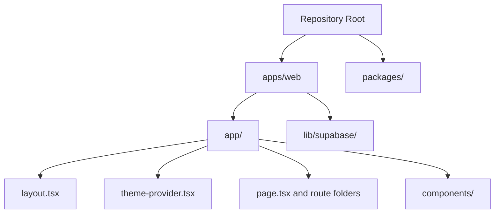

# Web App Docs

This section explains the Next.js app in `apps/web`.

The docs are written for a beginner audience. The goal is to explain both what
the files do and how React, Next.js, Material UI, and Supabase fit together.

## Guides

- [Overview](./overview.md): what the web app is and how it fits into the
  monorepo.
- [File Guide](./files.md): what every important file and folder in `apps/web`
  is for.
- [Page Guides](./pages/README.md): one guide per page and layout file.
- [Component Guides](./components/README.md): one guide per reusable component.
- [Theme Provider Guide](./theme-provider.md): how light and dark mode work.
- [Testing Guide](./testing.md): how Vitest, component tests, and coverage work.
- [Server Actions Guide](./server-actions.md): what server actions are and how
  Next.js uses them to move work from the browser to the server.
- [Supabase Setup](./supabase.md): quick-start notes for the current setup.
- [Supabase And Auth Docs](./supabase/README.md): deeper beginner guides for
  the Supabase files and auth flow.
- [Routing Guide](./routing.md): how Next.js App Router maps URLs to folders
  and files.
- [API Routes Guide](./api-routes.md): how App Router server endpoints such as
  `/api/health` work.
- [How Rendering Works](./rendering.md): how React and Next.js turn code into a
  page and update it after state changes.

## Quick Mental Model

If you are brand new to this repository, this is the simplest picture:

1. The repository root is the monorepo.
2. `apps/web` is the Next.js app.
3. `app/` holds the pages, layout, theme provider, and shared UI.
4. Material UI supplies the visual components and theming system.
5. Supabase supplies auth, persisted availability, and persisted ride requests.

## A Good Beginner Reading Order

If you want to learn the app step by step, this is a good path:

1. `apps/web/package.json`
2. `apps/web/app/layout.tsx`
3. `apps/web/app/theme-provider.tsx`
4. `apps/web/app/components/top-nav.tsx`
5. `apps/web/app/page.tsx`
6. `apps/web/app/components/click-counter.tsx`
7. `apps/web/lib/supabase/server.ts`
8. `apps/web/app/driver/actions.ts`
9. `apps/web/app/ride-requests/actions.ts`

That order helps you see:

- how the app runs
- how every page is wrapped
- how the Material UI theme is provided
- how shared navigation works
- how a page renders UI
- how client-side state works
- how server-side Supabase access works
- how driver availability is saved
- how persisted ride requests are created and claimed
- how the newer map-based components fit into those flows
