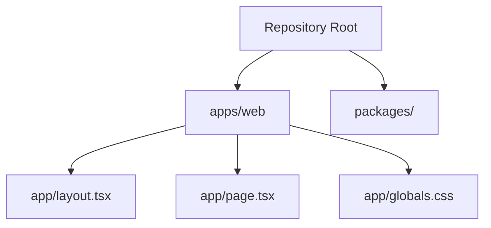

# Web App Docs

This section explains the Next.js app located in `apps/web`.

It is written for beginners, so the goal is not just to list files, but to
explain what each file is responsible for.

## Guides

- [Overview](./overview.md): what the web app is and how it fits into the
  monorepo.
- [File Guide](./files.md): what the important files and folders do.
- [How Rendering Works](./rendering.md): a simple explanation of how the app
  gets turned into a webpage.

## Quick Mental Model

If you are new to this repository, this is the simplest way to think about it:

1. The repository root is the monorepo.
2. `apps/web` is the website.
3. The `app/` folder inside `apps/web` contains pages, layout files, and styles.
4. Running `npm run dev` from the repo root starts the web app.

