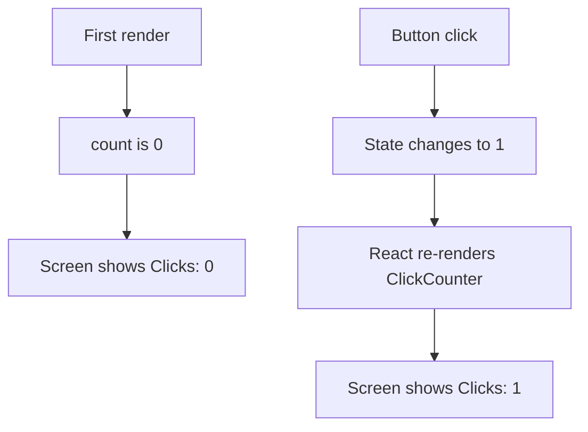
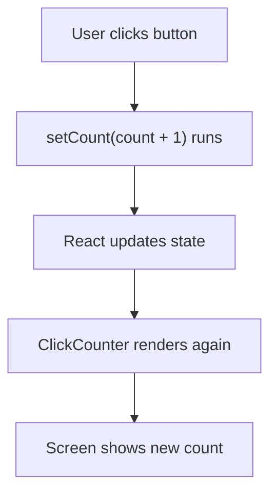
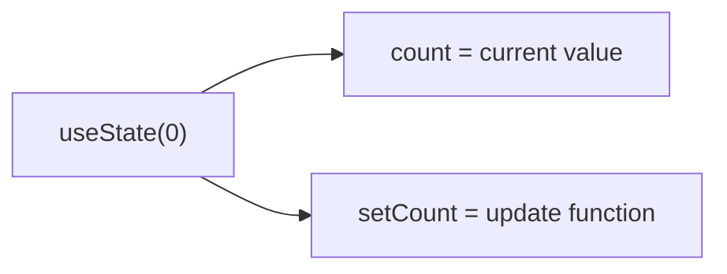
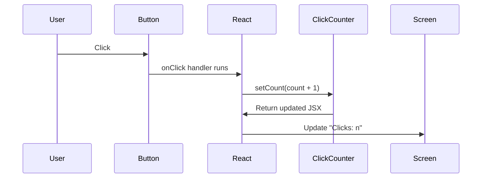

# Click Counter Guide

This guide explains every part of
`apps/web/app/components/click-counter.tsx`.

The goal is not just to describe the code, but to explain how React components
and React state work for a beginner.

## The Full Component

```tsx
"use client"

import { useState } from "react"

export default function ClickCounter() {
  const [count, setCount] = useState(0);

  return (
    <div>
      <div>Clicks: {count}</div>
      <button onClick={() => setCount(count + 1)}>Click Me</button>
    </div>
  )
}
```

## What This Component Does

When the page first loads, the component shows:

- `Clicks: 0`
- a button labeled `Click Me`

Each time the button is clicked:

1. React updates the `count` state value
2. the component runs again
3. the screen updates to show the new count

## What Does "Render" Mean?

In React, to render means:

- run the component function
- get back JSX
- use that JSX to decide what should appear on the screen

For `ClickCounter`, rendering means React runs this function:

```tsx
export default function ClickCounter() {
  const [count, setCount] = useState(0);

  return (
    <div>
      <div>Clicks: {count}</div>
      <button onClick={() => setCount(count + 1)}>Click Me</button>
    </div>
  )
}
```

When React runs that function the first time, `count` is `0`, so the UI says
`Clicks: 0`.

## What Does "Re-Render" Mean?

A re-render means React runs the component again after something changed.

In this component, the thing that changes is state.

When `count` changes:

1. React remembers the new value
2. React calls `ClickCounter` again
3. the JSX is created again using the new value
4. React updates only the part of the page that changed

That is why the text changes from `Clicks: 0` to `Clicks: 1`.

## Render And Re-Render Diagram



## Visual Overview



## Line By Line

## `"use client"`

```tsx
"use client"
```

This tells Next.js that this component should run on the client side in the
browser.

That matters because `useState` is an interactive React feature. The browser
needs to remember the current count and respond to clicks.

Without `"use client"`, Next.js would treat this file as a server component by
default, and hooks like `useState` would not be allowed here.

## `import { useState } from "react"`

```tsx
import { useState } from "react"
```

This line imports the `useState` hook from React.

A hook is a special React function that lets a component use React features.

In this case, `useState` gives the component a way to:

- store a value
- read that value later
- update that value
- re-render the component when the value changes

## `export default function ClickCounter()`

```tsx
export default function ClickCounter() {
```

This declares the React component.

A React component is usually just a JavaScript or TypeScript function that
returns JSX.

You can think of it like this:

- the function runs
- it decides what UI should look like
- it returns that UI

Because this function is the default export, other files can import it like
this:

```tsx
import ClickCounter from "./components/click-counter";
```

## `const [count, setCount] = useState(0);`

```tsx
const [count, setCount] = useState(0);
```

This is the most important line in the component.

It creates a piece of React state.

## What is state?

State is data that a component remembers over time.

A normal local variable does not survive re-renders in the same helpful way for
interactive UI. State does.

In this component, the state is:

- `count`, the current number of clicks

## Why are there two names?

`useState(0)` returns two things:

1. the current state value
2. a function that updates that state value

So in this code:

- `count` is the current number
- `setCount` is the function that changes the number

## Why does it start at `0`?

The `0` inside `useState(0)` is the initial value.

That means the first time the component appears, `count` starts as `0`.

## Visual State Model



## `return (...)`

```tsx
return (
  <div>
    <div>Clicks: {count}</div>
    <button onClick={() => setCount(count + 1)}>Click Me</button>
  </div>
)
```

This is the JSX that the component renders.

JSX looks like HTML, but it is actually JavaScript syntax that React uses to
describe the UI.

The returned JSX says:

- show a wrapper `<div>`
- show the text `Clicks:` followed by the current `count`
- show a button

## `Clicks: {count}`

```tsx
<div>Clicks: {count}</div>
```

The `{count}` part means "insert the current JavaScript value here."

If `count` is `0`, the screen shows:

```text
Clicks: 0
```

If `count` becomes `1`, React re-renders and the screen shows:

```text
Clicks: 1
```

## The Button

```tsx
<button onClick={() => setCount(count + 1)}>Click Me</button>
```

This button has an `onClick` handler.

That means React will run the provided function when the user clicks the
button.

## `onClick={() => setCount(count + 1)}`

```tsx
onClick={() => setCount(count + 1)}
```

This is an arrow function.

It says:

1. wait for a click
2. when the click happens, call `setCount`
3. give `setCount` the next value, which is the current `count` plus `1`

If `count` is `0`, then `count + 1` becomes `1`.

If `count` is `1`, then `count + 1` becomes `2`.

## What happens after `setCount` runs?

When `setCount` runs, React:

1. stores the new state value
2. runs the component again
3. compares the new UI to the old UI
4. updates the browser with the changed text

This process is called a re-render.

## Important Beginner Idea

React does not usually throw away the entire page and rebuild everything you can
see from scratch.

Instead, React:

- figures out what changed
- keeps the parts that stayed the same
- updates the specific part of the UI that needs to change

In `ClickCounter`, the visible change is very small:

- the button stays the same
- the wrapper `<div>` stays the same
- only the text showing the number changes

## Re-Render Diagram



## A Simple Mental Model

You can think about this component in three parts:

1. state: `count`
2. update function: `setCount`
3. UI: the JSX that shows the count and the button

That is a very common React pattern.

## Why this is a good beginner component

This component is small, but it teaches several core React ideas:

- components are functions
- JSX describes what should appear on the page
- state lets components remember values
- events like clicks can update state
- state updates cause React to re-render the UI

Once this pattern makes sense, more advanced React components become much easier
to understand.
