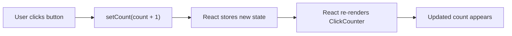

# Click Counter Guide

This guide explains `apps/web/app/components/click-counter.tsx` line by line.

The goal is not just to describe the code, but to explain how React components,
rendering, and state work for a beginner.

## The Full Component

```tsx
"use client"

import { useState } from "react"

export default function ClickCounter() {
  const [count, setCount] = useState(0);

  return (
    <div>
      <div>Clicks: {count}</div>
      <button onClick={() => setCount(count + 1)}>Click Me</button>
    </div>
  )
}
```

## What This Component Does

It shows a number and a button.

Each click increases the number by one.

## What "Render" Means

In React, rendering means React runs the component function and reads the JSX it
returns.

That JSX tells React what should appear on the page.

## What "Re-Render" Means

A re-render happens when React runs the component again because something
changed.

In this component, the thing that changes is state.

When `count` changes, React runs the component again and the new number appears
on screen.

## Line By Line

## `"use client"`

This tells Next.js that the component should run on the client side in the
browser.

That is important because interactive hooks like `useState` need to run in the
browser.

## `import { useState } from "react"`

This imports the `useState` hook from React.

`useState` lets a component remember a value over time.

## `export default function ClickCounter() {`

This defines the React component.

React components are functions that return JSX.

## `const [count, setCount] = useState(0);`

This creates a piece of state.

It gives you:

- `count`, the current value
- `setCount`, the function that updates the value

The `0` is the initial value.

## `return ( ... )`

This returns the JSX for the component.

## `<div>`

This is the outer wrapper element for the component.

## `<div>Clicks: {count}</div>`

This shows the current value of `count`.

The `{count}` part inserts the current JavaScript value into the JSX.

## `<button onClick={() => setCount(count + 1)}>Click Me</button>`

This renders a button with a click handler.

When the user clicks it:

1. the arrow function runs
2. `setCount(count + 1)` runs
3. React stores the new value
4. React re-renders the component
5. the screen updates

## State Update Diagram


