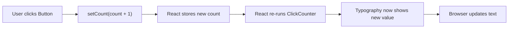

# Click Counter Guide

This guide explains `apps/web/app/components/click-counter.tsx` line by line.

The goal is not just to describe the code, but to explain how React components,
state, rendering, and re-rendering work for a beginner.

## The Full Component

```tsx
"use client"

import { useState } from "react"
import Button from "@mui/material/Button";
import Stack from "@mui/material/Stack";
import Typography from "@mui/material/Typography";

export default function ClickCounter() {
  const [count, setCount] = useState(0);

  return (
    <Stack spacing={2}>
      <Typography>Clicks: {count}</Typography>
      <Button variant="contained" onClick={() => setCount(count + 1)}>
        Click Me
      </Button>
    </Stack>
  )
}
```

## What This Component Does

It shows a number and a button.

Each click increases the number by one.

This makes it a very useful beginner example because it shows how React state
changes and how the page updates afterward.

## What "Render" Means

In React, rendering means React runs the component function and reads the JSX it
returns.

That JSX describes what should appear on the screen.

## What "Re-Render" Means

A re-render happens when React runs the component again because something
changed.

In this component, the changing thing is state.

When `count` changes, React re-runs `ClickCounter`, sees the new count value,
and updates the visible text.

## Line By Line

## `"use client"`

This tells Next.js that the component should run on the client side in the
browser.

That matters because interactive hooks like `useState` need browser-side
execution.

## `import { useState } from "react"`

This imports the `useState` hook from React.

`useState` lets a component remember a value over time.

Without it, the number would not persist between renders.

## `import Button ... Stack ... Typography ...`

These imports bring in Material UI components:

- `Button`: a styled button
- `Stack`: a layout helper that arranges children with spacing
- `Typography`: styled text

## `export default function ClickCounter() {`

This defines the component.

A React component is a function that returns JSX.

## `const [count, setCount] = useState(0);`

This creates a piece of state.

It gives you:

- `count`: the current value
- `setCount`: the function that updates the value

The `0` is the initial value, so the first render starts with `count` equal to
zero.

## `return ( ... )`

This returns the JSX for the component.

## `<Stack spacing={2}>`

This creates a vertical layout container.

`Stack` is a Material UI helper that lays out children in a simple column by
default.

`spacing={2}` adds theme-based space between the children.

## `<Typography>Clicks: {count}</Typography>`

This displays the current count.

The `{count}` part inserts the current JavaScript value into the JSX.

If `count` is `0`, the text becomes:

```text
Clicks: 0
```

If `count` later becomes `3`, the text becomes:

```text
Clicks: 3
```

## `<Button variant="contained" onClick={() => setCount(count + 1)}>`

This renders a Material UI button.

`variant="contained"` gives the button a filled style.

The `onClick` prop defines what should happen when the user clicks it.

## `() => setCount(count + 1)`

This is an arrow function.

When the click happens, it calls `setCount` with the next value.

If `count` was `0`, then `count + 1` becomes `1`.

If `count` was `1`, then `count + 1` becomes `2`.

## How The Re-Render Happens

When the user clicks the button:

1. the `onClick` function runs
2. `setCount(count + 1)` tells React to update state
3. React stores the new count
4. React runs `ClickCounter()` again
5. the returned JSX now contains the new number
6. React updates the browser output



## Why State Matters

State is data that a component remembers across renders.

Without state, the component would not know the previous number, so each click
could not build on the last one.
