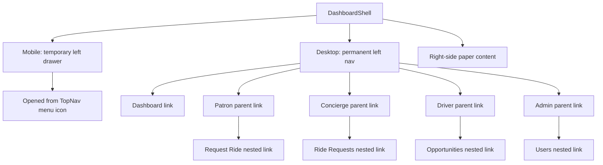

# Dashboard Shell Guide

This guide explains `apps/web/app/components/dashboard-shell.tsx` line by line.

## The Full File

```tsx
"use client";

import { useEffect, useState, type ReactNode } from "react";
import Link from "next/link";
import { usePathname } from "next/navigation";
import Box from "@mui/material/Box";
import Collapse from "@mui/material/Collapse";
import Drawer from "@mui/material/Drawer";
import List from "@mui/material/List";
import ListItem from "@mui/material/ListItem";
import ListItemButton from "@mui/material/ListItemButton";
import ListItemText from "@mui/material/ListItemText";
import Paper from "@mui/material/Paper";

const drawerWidth = 240;

const navigationItems = [
  {
    href: "/dashboard",
    label: "Dashboard"
  },
  {
    href: "/patron",
    label: "Patron",
    children: [
      {
        href: "/patron/request",
        label: "Request Ride"
      }
    ]
  },
  {
    href: "/concierge",
    label: "Concierge",
    children: [
      {
        href: "/concierge/requests",
        label: "Ride Requests"
      }
    ]
  },
  {
    href: "/driver",
    label: "Driver",
    children: [
      {
        href: "/driver/opportunities",
        label: "Opportunities"
      }
    ]
  },
  {
    href: "/admin",
    label: "Admin",
    children: [
      {
        href: "/admin/users",
        label: "Users"
      }
    ]
  }
];

function DashboardNav({
  currentPath,
  onNavigate
}: {
  currentPath: string;
  onNavigate: () => void;
}) {
  return (
    <Box
      sx={(theme) => ({
        bgcolor: theme.palette.mode === "dark" ? "grey.900" : "grey.200",
        color: "text.primary",
        height: "100%"
      })}
    >
      <List sx={{ py: 2 }}>
        {navigationItems.map((item) => (
          <Box key={item.href}>
            <ListItemButton
              component={Link}
              href={item.href}
              selected={
                currentPath === item.href || currentPath.startsWith(`${item.href}/`)
              }
              onClick={onNavigate}
              sx={{
                mx: 1,
                borderRadius: 1
              }}
            >
              <ListItemText primary={item.label} />
            </ListItemButton>
            {item.children ? (
              <Collapse
                in={currentPath === item.href || currentPath.startsWith(`${item.href}/`)}
                timeout="auto"
                unmountOnExit={false}
              >
                <List disablePadding>
                  {item.children.map((child) => (
                    <ListItem key={child.href} disablePadding>
                      <ListItemButton
                        component={Link}
                        href={child.href}
                        selected={currentPath === child.href}
                        onClick={onNavigate}
                        sx={{
                          ml: 3,
                          mr: 1,
                          borderRadius: 1
                        }}
                      >
                        <ListItemText primary={child.label} />
                      </ListItemButton>
                    </ListItem>
                  ))}
                </List>
              </Collapse>
            ) : null}
          </Box>
        ))}
      </List>
    </Box>
  );
}

export default function DashboardShell({
  children
}: {
  children: ReactNode;
}) {
  const pathname = usePathname();
  const [mobileOpen, setMobileOpen] = useState(false);

  const closeDrawer = () => {
    setMobileOpen(false);
  };

  useEffect(() => {
    const handleOpen = () => {
      setMobileOpen(true);
    };

    window.addEventListener("dashboard-nav:open", handleOpen);

    return () => {
      window.removeEventListener("dashboard-nav:open", handleOpen);
    };
  }, []);

  return (
    <Box
      component="main"
      sx={{
        display: "flex",
        gap: 3,
        pl: 0,
        pr: {
          xs: 2,
          md: 3
        },
        py: 4
      }}
    >
      <Box
        sx={{
          width: {
            md: drawerWidth
          },
          flexShrink: {
            md: 0
          }
        }}
      >
        <Drawer
          variant="temporary"
          open={mobileOpen}
          onClose={closeDrawer}
          ModalProps={{
            keepMounted: true
          }}
          sx={{
            display: {
              xs: "block",
              md: "none"
            },
            "& .MuiDrawer-paper": {
              boxSizing: "border-box",
              borderRight: 0,
              width: drawerWidth
            }
          }}
        >
          <DashboardNav currentPath={pathname} onNavigate={closeDrawer} />
        </Drawer>
        <Drawer
          variant="permanent"
          open
          sx={{
            display: {
              xs: "none",
              md: "block"
            },
            "& .MuiDrawer-paper": {
              boxSizing: "border-box",
              borderRight: 0,
              position: "relative",
              width: drawerWidth
            }
          }}
        >
          <DashboardNav currentPath={pathname} onNavigate={() => undefined} />
        </Drawer>
      </Box>
      <Box sx={{ flex: 1, minWidth: 0 }}>
        <Paper sx={{ p: 4 }}>{children}</Paper>
      </Box>
    </Box>
  );
}
```

## What This Component Does

This component creates the shared app-area layout for pages like `/dashboard`,
`/patron`, `/concierge`, `/driver`, `/admin`, and `/admin/users`.

It provides:

- a permanent left navigation on desktop
- a temporary left drawer on mobile
- nested role subsections
- a main content surface on the right
- theme-aware nav colors for both light and dark mode

## Key Ideas

- the dashboard area has its own layout inside the main app
- `Patron`, `Concierge`, and `Driver` behave like parent items in the left nav
- `Admin` behaves like a parent item in the left nav
- child links appear nested under each parent item
- on mobile, the drawer opens when the top nav dispatches a
  `"dashboard-nav:open"` browser event
- the current route controls which items appear selected and which submenu is
  expanded

## Responsive Diagram


