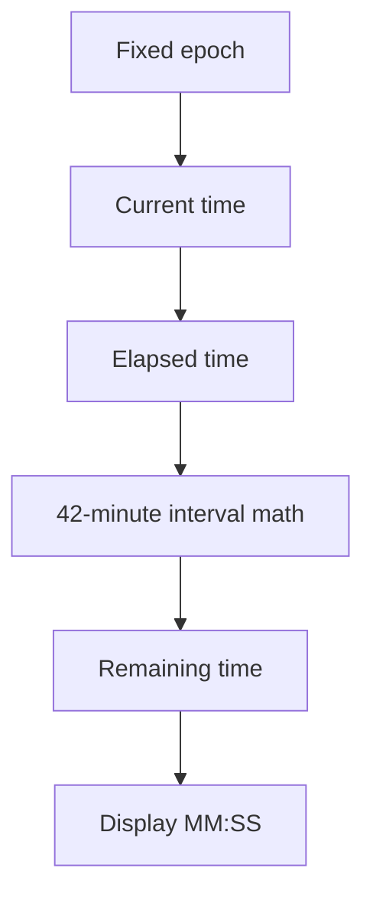

# Death Clock Guide

This guide explains `apps/web/app/components/death-clock.tsx`.

## What This Component Does

This component shows a persistent countdown based on the commonly quoted U.S.
figure of about one alcohol-impaired-driving death every 42 minutes.

It is not a real prediction of the next crash.

Instead, it is a rotating timer meant to make the statistic feel concrete and
visible on the landing page.

## Key Ideas

- it is a client component because it updates every second
- it uses a fixed time interval of 42 minutes
- it uses a fixed epoch so refreshing the page does not restart the clock
- it formats the remaining time as `MM:SS`
- it is designed to sit as a bold numeric object inside the landing-page
  section, with the large numbers aligned to the right on larger screens

## How Persistence Works

The component does not store its state in a database or in local storage.

Instead, it stays consistent by calculating the remaining time from:

- a fixed starting timestamp
- the current time
- the fixed 42-minute interval

That means two different page loads at the same moment will show the same
countdown.

## How It Fits Into The Page

The component itself is intentionally small in scope.

It only renders:

- the large countdown
- a short supporting line underneath

The surrounding explanatory copy lives in `app/page.tsx`, not inside the
component. That keeps the clock focused on being the visual stat object.

## Clock Flow Diagram

