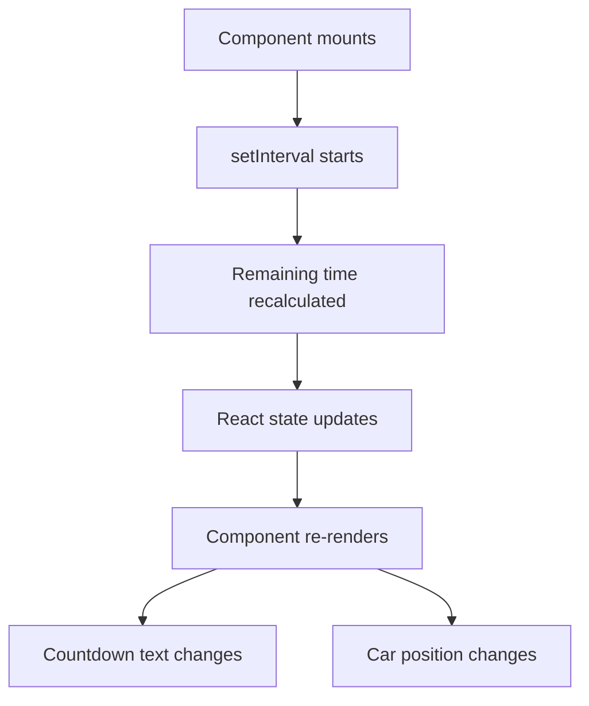
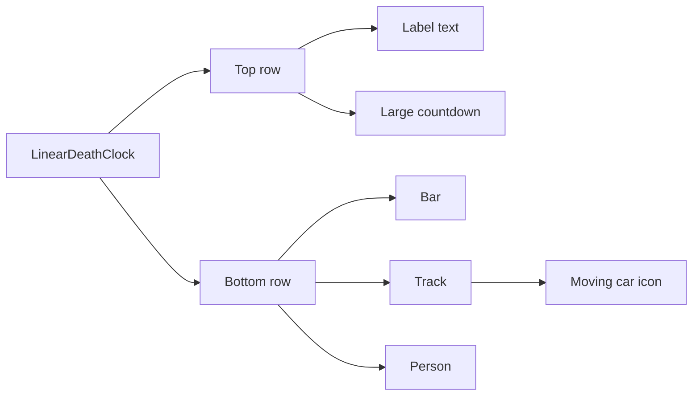

# Linear Death Clock Guide

This guide explains `apps/web/app/components/linear-death-clock.tsx`.

## What This Component Does

This component shows a full-width visual version of the death clock used on the
homepage.

Instead of showing only a number, it turns the 42-minute statistic into a
simple scene:

- a bar on the left
- a road-like track across the middle
- a car moving across that track
- a person marker on the far right

It also shows the large countdown number so the user can still read the time
remaining directly.

## Why It Is A Client Component

The file starts with `"use client";`.

That tells Next.js this component runs in the browser.

It needs browser-side React because it updates every second.

## The Main React Flow

The component uses:

- `useState` to store the current remaining time
- `useEffect` to start a timer after the component mounts

Every second, the timer recalculates the remaining time and updates state.

When state changes, React renders the component again, which updates:

- the big `MM:SS` display
- the car position across the track

## How The Time Stays Persistent

This component does not store anything in a database or local storage.

Instead, it calculates the remaining time from:

- a fixed epoch
- the current time
- a fixed 42-minute interval

That means reloading the page does not reset the clock back to the beginning.

## How The Layout Works

The component uses a Material UI `Paper` as its outer surface.

Inside that surface, it has two main rows:

1. a top row with label text on the left and the large countdown on the right
2. a lower row with the bar label, the track, and the person marker

On mobile, these stack more vertically.

On wider screens, they spread across the full width.

## Visual Structure

## Why This Component Exists

There is still a smaller `death-clock.tsx` component in the repository.

That older component is useful as a simpler learning example.

This newer component exists because the homepage needed a stronger, full-width
visual treatment that feels more like a section of the page instead of just a
number inside a box.
