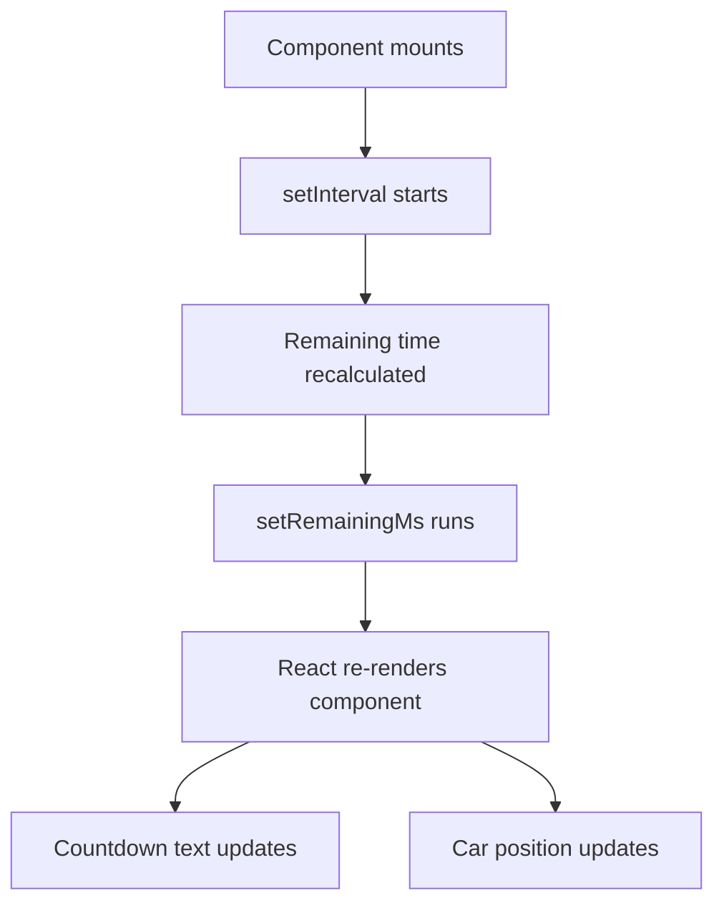
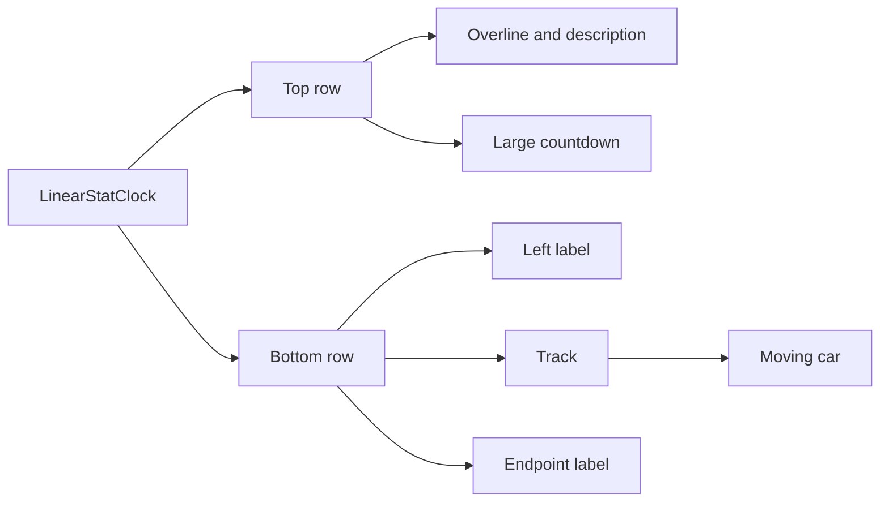

# Linear Stat Clock Guide

This guide explains `apps/web/app/components/linear-stat-clock.tsx`.

## What This Component Does

This component renders the full-width moving statistic display used on the
homepage.

It is reusable, which means the same component can show more than one
statistic while keeping the same visual style.

Right now the homepage uses it for:

- alcohol-impaired-driving deaths
- DUI arrests

## Why This Component Exists

Earlier in the project, there was a dedicated `linear-death-clock.tsx`
component built only for the death statistic.

The app now uses `linear-stat-clock.tsx` instead because the same layout is
useful for more than one kind of number.

That is a common React refactor:

- first build a component for one specific case
- then generalize it into a reusable component when a second case appears

## The Props Idea

This component takes props.

Props are inputs that let a parent component customize how a child component
looks or behaves.

In this file, props control things like:

- the overline text
- the section description
- the interval length
- the left-side label
- the right-side label
- whether the endpoint icon should be a `person` or `police`

That means the page can reuse the same component structure without copying all
the JSX twice.

## Why It Is A Client Component

The file begins with `"use client";`.

That tells Next.js the component runs in the browser.

It needs to run in the browser because it updates every second using React
state.

## React Flow

The component uses:

- `useState` to store the current remaining time
- `useEffect` to start a repeating timer

Every second:

1. the timer recalculates the remaining time
2. React state updates
3. the component re-renders
4. the number and car position both update

## Persistence

The component uses:

- a fixed epoch timestamp
- the current time
- the interval passed in through props

That makes the timer persistent across refreshes.

The clock does not restart from the beginning just because the page reloads.

## Layout Breakdown

The component renders a `Paper` with two major rows:

1. a top row with explanatory text and the large countdown
2. a lower row with the starting label, the track, and the end marker

The lower row also includes the moving car.

## Visual Structure

## How The Homepage Uses It

The homepage imports this component and passes different props twice:

- once for deaths
- once for arrests

That is a beginner-friendly example of component reuse in React.
