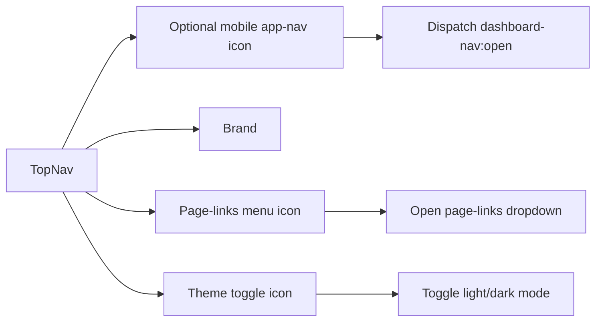

# Top Navigation Guide

This guide explains `apps/web/app/components/top-nav.tsx` line by line.

## The Full File

```tsx
"use client";

import { useState } from "react";
import Link from "next/link";
import { usePathname } from "next/navigation";
import DarkModeIcon from "@mui/icons-material/DarkMode";
import LightModeIcon from "@mui/icons-material/LightMode";
import MenuIcon from "@mui/icons-material/Menu";
import AppBar from "@mui/material/AppBar";
import Box from "@mui/material/Box";
import IconButton from "@mui/material/IconButton";
import Menu from "@mui/material/Menu";
import MenuItem from "@mui/material/MenuItem";
import Toolbar from "@mui/material/Toolbar";
import Typography from "@mui/material/Typography";
import { useColorMode } from "../theme-provider";

export default function TopNav() {
  const pathname = usePathname();
  const { mode, toggleColorMode } = useColorMode();
  const [menuAnchor, setMenuAnchor] = useState<null | HTMLElement>(null);
  const showsDashboardDrawerTrigger =
    pathname === "/dashboard" || pathname === "/admin";

  const openMenu = (event: React.MouseEvent<HTMLElement>) => {
    setMenuAnchor(event.currentTarget);
  };

  const closeMenu = () => {
    setMenuAnchor(null);
  };

  const openDashboardDrawer = () => {
    window.dispatchEvent(new CustomEvent("dashboard-nav:open"));
  };

  return (
    <AppBar position="static" color="transparent" elevation={0}>
      <Toolbar
        sx={{
          gap: 1,
          minHeight: {
            xs: 64,
            sm: 72
          },
          px: {
            xs: 2,
            sm: 3
          }
        }}
      >
        {showsDashboardDrawerTrigger ? (
          <IconButton
            aria-label="Open app navigation"
            onClick={openDashboardDrawer}
            sx={{ display: { xs: "inline-flex", md: "none" } }}
          >
            <MenuIcon />
          </IconButton>
        ) : null}
        <Typography noWrap variant="h6">
          Designated
        </Typography>
        <Box sx={{ flexGrow: 1 }} />
        <IconButton
          aria-controls={menuAnchor ? "page-links-menu" : undefined}
          aria-expanded={menuAnchor ? "true" : undefined}
          aria-haspopup="true"
          aria-label="Open navigation menu"
          onClick={openMenu}
        >
          <MenuIcon />
        </IconButton>
        <Menu
          id="page-links-menu"
          anchorEl={menuAnchor}
          open={Boolean(menuAnchor)}
          onClose={closeMenu}
        >
          <MenuItem component={Link} href="/" onClick={closeMenu}>
            Home
          </MenuItem>
          <MenuItem component={Link} href="/about" onClick={closeMenu}>
            About
          </MenuItem>
          <MenuItem component={Link} href="/contact" onClick={closeMenu}>
            Contact
          </MenuItem>
          <MenuItem component={Link} href="/sign-up" onClick={closeMenu}>
            Sign Up
          </MenuItem>
          <MenuItem component={Link} href="/sign-in" onClick={closeMenu}>
            Sign In
          </MenuItem>
          <MenuItem component={Link} href="/dashboard" onClick={closeMenu}>
            Dashboard
          </MenuItem>
          <MenuItem component={Link} href="/admin" onClick={closeMenu}>
            Admin
          </MenuItem>
        </Menu>
        <IconButton
          aria-label={
            mode === "light" ? "Switch to dark mode" : "Switch to light mode"
          }
          onClick={toggleColorMode}
        >
          {mode === "light" ? <DarkModeIcon /> : <LightModeIcon />}
        </IconButton>
      </Toolbar>
    </AppBar>
  );
}
```

## What This Component Does

This component renders the shared top bar for the whole site.

It does four jobs:

- shows the brand name
- opens the app-area drawer on mobile dashboard/admin pages
- opens the general page-links dropdown
- toggles light and dark mode

## Key Ideas

- `usePathname()` lets the nav know whether it is on `/dashboard` or `/admin`
- the mobile app-nav trigger appears only on dashboard-area pages
- the dashboard drawer trigger and the general page menu are different buttons
- the toolbar height is fixed so the bar stays consistent instead of wrapping

## Top Nav Diagram


