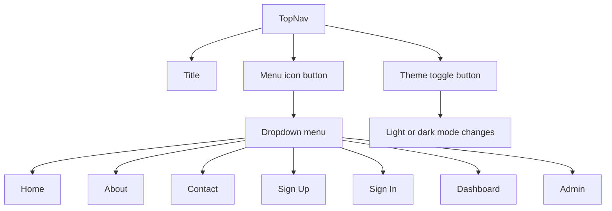

# Top Navigation Guide

This guide explains `apps/web/app/components/top-nav.tsx` line by line.

## The Full File

```tsx
"use client";

import { useState } from "react";
import Link from "next/link";
import DarkModeIcon from "@mui/icons-material/DarkMode";
import LightModeIcon from "@mui/icons-material/LightMode";
import MenuIcon from "@mui/icons-material/Menu";
import AppBar from "@mui/material/AppBar";
import Box from "@mui/material/Box";
import IconButton from "@mui/material/IconButton";
import Menu from "@mui/material/Menu";
import MenuItem from "@mui/material/MenuItem";
import Toolbar from "@mui/material/Toolbar";
import Typography from "@mui/material/Typography";
import { useColorMode } from "../theme-provider";

export default function TopNav() {
  const { mode, toggleColorMode } = useColorMode();
  const [menuAnchor, setMenuAnchor] = useState<null | HTMLElement>(null);

  const openMenu = (event: React.MouseEvent<HTMLElement>) => {
    setMenuAnchor(event.currentTarget);
  };

  const closeMenu = () => {
    setMenuAnchor(null);
  };

  return (
    <AppBar position="static" color="transparent" elevation={0}>
      <Toolbar sx={{ gap: 2, flexWrap: "wrap" }}>
        <Typography variant="h6">Designated</Typography>
        <Box sx={{ flexGrow: 1 }} />
        <IconButton
          aria-controls={menuAnchor ? "page-links-menu" : undefined}
          aria-expanded={menuAnchor ? "true" : undefined}
          aria-haspopup="true"
          aria-label="Open navigation menu"
          onClick={openMenu}
        >
          <MenuIcon />
        </IconButton>
        <Menu
          id="page-links-menu"
          anchorEl={menuAnchor}
          open={Boolean(menuAnchor)}
          onClose={closeMenu}
        >
          <MenuItem component={Link} href="/" onClick={closeMenu}>
            Home
          </MenuItem>
          <MenuItem component={Link} href="/about" onClick={closeMenu}>
            About
          </MenuItem>
          <MenuItem component={Link} href="/contact" onClick={closeMenu}>
            Contact
          </MenuItem>
          <MenuItem component={Link} href="/sign-up" onClick={closeMenu}>
            Sign Up
          </MenuItem>
          <MenuItem component={Link} href="/sign-in" onClick={closeMenu}>
            Sign In
          </MenuItem>
          <MenuItem component={Link} href="/dashboard" onClick={closeMenu}>
            Dashboard
          </MenuItem>
          <MenuItem component={Link} href="/admin" onClick={closeMenu}>
            Admin
          </MenuItem>
        </Menu>
        <IconButton
          aria-label={mode === "light" ? "Switch to dark mode" : "Switch to light mode"}
          onClick={toggleColorMode}
        >
          {mode === "light" ? <DarkModeIcon /> : <LightModeIcon />}
        </IconButton>
      </Toolbar>
    </AppBar>
  );
}
```

## What This Component Does

This component shows the shared top bar for the site.

It does three main jobs:

- shows the app name
- opens a dropdown menu of page links
- lets the user switch between light and dark mode

## Why This Is A Client Component

The file starts with `"use client";`.

That is necessary because this component uses:

- `useState`
- click handlers
- the `useColorMode()` hook

Those features need to run in the browser.

## Line By Line

## `import { useState } from "react";`

This imports React state.

The menu needs state so the component can remember whether the dropdown should
be open and which HTML element it should be attached to.

## `import Link from "next/link";`

This imports Next.js `Link`.

It is used for navigation between pages in the app.

## `import DarkModeIcon ... LightModeIcon ... MenuIcon ...`

These imports bring in small icon components from Material UI’s icon package.

They are regular React components that render SVG icons.

## `import AppBar ... Typography ...`

These imports bring in Material UI building blocks:

- `AppBar`: a top bar container
- `Toolbar`: inner layout for the bar
- `Box`: a general-purpose layout wrapper
- `IconButton`: a clickable icon button
- `Menu`: the dropdown container
- `MenuItem`: one clickable item inside the dropdown
- `Typography`: styled text

## `import { useColorMode } from "../theme-provider";`

This imports the custom hook from the theme provider file.

That hook gives this component access to:

- the current mode
- the toggle function

## `const { mode, toggleColorMode } = useColorMode();`

This reads the current color mode context.

`mode` will be either `"light"` or `"dark"`.

`toggleColorMode` is the function that switches to the other mode.

## `const [menuAnchor, setMenuAnchor] = useState<null | HTMLElement>(null);`

This creates component state for the dropdown menu.

Material UI’s `Menu` needs to know which element it should open next to.

At first, there is no anchor element, so the state starts as `null`.

## `const openMenu = (event: React.MouseEvent<HTMLElement>) => { ... }`

This function runs when the menu icon button is clicked.

It stores the clicked element in state by calling:

```tsx
setMenuAnchor(event.currentTarget);
```

That gives the `Menu` a real anchor element.

## `const closeMenu = () => { setMenuAnchor(null); };`

This closes the menu by clearing the anchor.

If the anchor is `null`, the menu is considered closed.

## `<AppBar position="static" color="transparent" elevation={0}>`

This creates the outer top bar.

- `position="static"` means it stays in normal page flow
- `color="transparent"` removes a strong default background color
- `elevation={0}` removes the drop shadow

## `<Toolbar sx={{ gap: 2, flexWrap: "wrap" }}>`

This creates the inner layout row.

The `sx` prop is Material UI’s quick styling prop.

Here it says:

- `gap: 2`: place space between items
- `flexWrap: "wrap"`: allow wrapping on smaller screens

## `<Typography variant="h6">Designated</Typography>`

This shows the app title.

`variant="h6"` tells Material UI which text style to use.

## `<Box sx={{ flexGrow: 1 }} />`

This is a flexible spacer.

It grows to fill the empty space in the toolbar, which pushes the icon buttons
to the right side.

## First `<IconButton ... onClick={openMenu}>`

This is the navigation menu button.

Its `aria-*` props improve accessibility by describing the relationship between
the button and the dropdown menu.

When clicked, it calls `openMenu`.

## `<MenuIcon />`

This renders the menu icon inside the button.

## `<Menu ...>`

This renders the dropdown menu itself.

Important props:

- `id`: gives the menu a stable identifier
- `anchorEl={menuAnchor}`: tells MUI which element to attach to
- `open={Boolean(menuAnchor)}`: opens when there is an anchor
- `onClose={closeMenu}`: closes when MUI requests it

## `<MenuItem component={Link} href="..." onClick={closeMenu}>`

Each menu item is both:

- a Material UI menu row
- a Next.js link

This is possible because `component={Link}` tells MUI to render the menu item
using the `Link` component underneath.

Each item also calls `closeMenu` so the dropdown disappears after selection.

## Second `<IconButton ... onClick={toggleColorMode}>`

This is the theme toggle button.

When clicked, it switches between light and dark mode.

The `aria-label` changes based on the current mode so screen readers get a
clear action description.

## `{mode === "light" ? <DarkModeIcon /> : <LightModeIcon />}`

This is conditional rendering.

If the current mode is light, the button shows the moon-style dark-mode icon.

If the current mode is dark, the button shows the light-mode icon.

That gives the user a hint about what clicking the button will do next.

## Navigation Diagram


