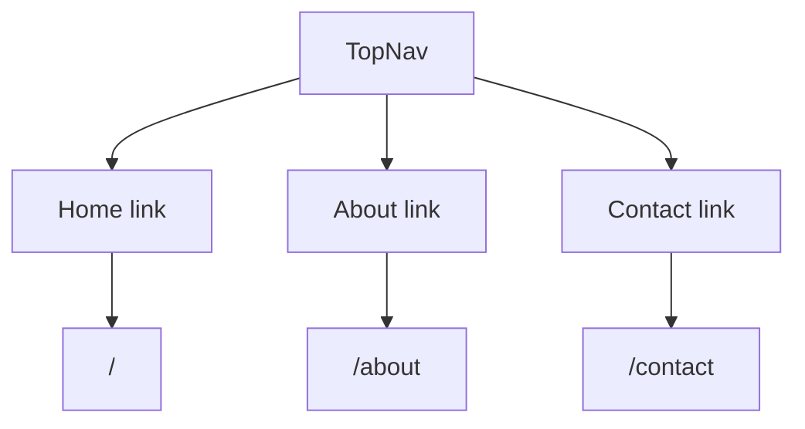

# Top Navigation Guide

This guide explains `apps/web/app/components/top-nav.tsx` line by line.

## The Full File

```tsx
import Link from "next/link";

export default function TopNav() {
  return (
    <nav aria-label="Primary">
      <ul className="top-nav">
        <li>
          <Link href="/">Home</Link>
        </li>
        <li>
          <Link href="/about">About</Link>
        </li>
        <li>
          <Link href="/contact">Contact</Link>
        </li>
      </ul>
    </nav>
  );
}
```

## What This Component Does

This component shows the top navigation for the site.

It gives the user links to the three current pages:

- `/`
- `/about`
- `/contact`

## Line By Line

## `import Link from "next/link";`

This imports the `Link` component from Next.js.

`Link` is used for navigation between pages in a Next.js app.

## `export default function TopNav() {`

This defines the `TopNav` component.

## `<nav aria-label="Primary">`

This creates a semantic navigation element.

The `aria-label="Primary"` gives assistive technology a clearer name for the
navigation region.

## `<ul className="top-nav">`

This creates an unordered list for the links.

The `className="top-nav"` connects this element to the global CSS class that
styles the navigation.

## `<li>`

Each `<li>` is one list item in the navigation.

## `<Link href="/">Home</Link>`

This renders a link to the homepage.

The `href="/"` tells Next.js which URL to navigate to.

## `<Link href="/about">About</Link>`

This renders a link to the About page.

## `<Link href="/contact">Contact</Link>`

This renders a link to the Contact page.

## Navigation Diagram


