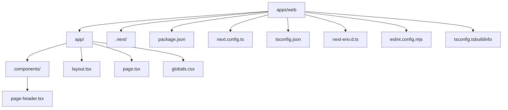

# Web App File Guide

This guide explains every current file and folder inside `apps/web`.

Some entries are source files that you edit directly. Others are generated
artifacts created by Next.js or TypeScript. This guide calls that out so a
beginner can tell the difference.

## File Map

## Top-Level Folders

## `apps/web/`

This is the root of the Next.js workspace.

It contains:

- source code in `app/`
- generated output in `.next/`
- project configuration files such as `package.json` and `tsconfig.json`

## `apps/web/app/`

This is the main App Router source folder.

Next.js reads this folder to figure out:

- which URLs exist
- which layouts wrap those URLs
- which components render those pages

## `apps/web/app/components/`

This folder holds reusable UI components used by files in `app/`.

Right now it contains only one component, `page-header.tsx`.

## `apps/web/.next/`

This folder is generated by Next.js.

You usually do not edit it by hand.

It contains build output, route metadata, compiled server files, static assets,
and development-server caches.

## Generated Folders Inside `.next/`

## `apps/web/.next/cache/`

Cache data used to speed up builds and development tasks.

## `apps/web/.next/dev/`

Files created while the development server is running.

This is the development version of the build output.

## `apps/web/.next/dev/cache/`

Extra development cache data.

## `apps/web/.next/dev/cache/turbopack/`

Turbopack-specific cached data used during development.

## `apps/web/.next/dev/logs/`

Development log files written by Next.js.

## `apps/web/.next/dev/server/`

Compiled server output for development mode.

## `apps/web/.next/dev/server/app/`

Development-mode compiled files for App Router routes.

## `apps/web/.next/dev/server/chunks/`

Server-side JavaScript chunks created in development mode.

## `apps/web/.next/dev/static/`

Development static assets served by Next.js.

## `apps/web/.next/dev/static/chunks/`

Development JavaScript and CSS chunks.

## `apps/web/.next/dev/static/development/`

Extra static assets used only during development.

## `apps/web/.next/dev/types/`

Generated TypeScript helper files for development mode.

## `apps/web/.next/diagnostics/`

Build diagnostics and framework metadata produced by Next.js.

## `apps/web/.next/server/`

Compiled server output for production builds.

## `apps/web/.next/server/app/`

Compiled App Router files for production output.

## `apps/web/.next/server/app/_global-error/`

Generated output for the global error route handling.

## `apps/web/.next/server/app/_global-error.segments/`

Segment metadata used by the compiled global error route.

## `apps/web/.next/server/app/_not-found/`

Generated output for Next.js not-found handling.

## `apps/web/.next/server/app/_not-found.segments/`

Segment metadata used by the compiled not-found route.

## `apps/web/.next/server/app/index.segments/`

Segment metadata for the homepage route.

## `apps/web/.next/server/app/page/`

Compiled output related to the homepage page module.

## `apps/web/.next/server/chunks/`

Compiled server-side chunks for the build.

## `apps/web/.next/server/chunks/ssr/`

Chunks used for server-side rendering output.

## `apps/web/.next/server/pages/`

Generated Pages Router-style fallback pages such as `404.html` and `500.html`.

## `apps/web/.next/static/`

Static assets produced by the build.

## `apps/web/.next/static/3585uOhVVxXrjnolAO3_j/`

A build-specific asset folder. The hashed name changes between builds.

## `apps/web/.next/static/chunks/`

Built JavaScript and CSS chunks served to the browser.

## `apps/web/.next/types/`

Generated TypeScript route and validation helper files.

## Top-Level Files

## `apps/web/package.json`

This file describes the web workspace itself.

It tells npm:

- the workspace name
- which scripts exist
- which packages the app depends on

In this project, the most important scripts are:

- `dev`: start the local development server
- `build`: create a production build
- `start`: run the production server
- `lint`: run ESLint on the app

## `apps/web/app/layout.tsx`

This is the root layout.

Think of it as the outer shell for the app. It wraps every page and is a common
place to put:

- the `<html>` and `<body>` tags
- shared navigation
- shared metadata like the page title
- global providers later on

In this repository, it also imports the global stylesheet.

## `apps/web/app/page.tsx`

This file defines the home page at `/`.

When someone opens the site, this component is what they see first.

If you want to change the homepage content, this is one of the first files to
edit.

## `apps/web/app/components/page-header.tsx`

This is a small reusable React component.

Right now it accepts one prop:

- `heading`

The homepage uses it to render the page heading.

## `apps/web/app/globals.css`

This file contains styles that apply across the app.

Right now it is intentionally minimal.

It only defines a small set of reset defaults such as:

- `box-sizing: border-box`
- `body` margin reset
- image and media display defaults
- form control font inheritance
- default margin removal for paragraphs and headings

This means the app has predictable browser defaults without a custom design
system layered on top.

## `apps/web/next.config.ts`

This is where Next.js project-level configuration lives.

It is currently minimal, which is fine for a small starter app. Later, this is
where you might add options for images, redirects, headers, or experimental
features.

## `apps/web/tsconfig.json`

This file configures TypeScript for the web app.

It extends the root `tsconfig.base.json`, which lets the monorepo share common
TypeScript settings.

That setup is useful because multiple apps or packages can follow the same base
rules without copying configuration everywhere.

## `apps/web/next-env.d.ts`

This file is created for Next.js TypeScript support.

Most of the time, you do not need to edit it manually.

## `apps/web/eslint.config.mjs`

This file configures ESLint for the web app.

It imports Next.js lint rules so the project follows common React and Next.js
best practices.

## `apps/web/tsconfig.tsbuildinfo`

This is a generated TypeScript cache file.

It exists to make repeated TypeScript work faster. You do not normally edit it
by hand.

## Notable Generated Files Inside `.next/`

The `.next/` folder contains many generated files. The exact list changes often,
but the current build includes examples like these:

## `apps/web/.next/BUILD_ID`

The current build identifier.

## `apps/web/.next/app-path-routes-manifest.json`

Generated route metadata for App Router paths.

## `apps/web/.next/build-manifest.json`

An index of build output files and chunks.

## `apps/web/.next/export-marker.json`

Metadata about export and output behavior.

## `apps/web/.next/fallback-build-manifest.json`

Build metadata used for fallback behavior.

## `apps/web/.next/images-manifest.json`

Generated metadata for image handling.

## `apps/web/.next/next-minimal-server.js.nft.json`

Tracing metadata for the minimal production server output.

## `apps/web/.next/next-server.js.nft.json`

Tracing metadata for the production server output.

## `apps/web/.next/package.json`

A generated package file used within the build output.

## `apps/web/.next/prerender-manifest.json`

Metadata about prerendered routes.

## `apps/web/.next/required-server-files.js`

A generated file listing server files required to run the app.

## `apps/web/.next/required-server-files.json`

JSON metadata about required server files.

## `apps/web/.next/routes-manifest.json`

Generated route metadata used by the built app.

## `apps/web/.next/trace`

A trace file produced during build or server work.

## `apps/web/.next/trace-build`

A build trace file.

## `apps/web/.next/turbopack`

Internal Turbopack build data used by Next.js.

Turbopack-generated internal build data.
