# Web App File Guide

This guide explains the important files and folders inside `apps/web`.

Some of them are source files you edit directly. Others are generated by
Next.js or TypeScript. This guide calls that out so a beginner can tell the
difference.

## File Map

```mermaid
flowchart TD
    A["apps/web"] --> B["app/"]
    A --> C["lib/"]
    A --> D["scripts/"]
    A --> E[".next/"]
    A --> F["package.json"]
    A --> G["next.config.ts"]
    A --> H["tsconfig.json"]
    A --> I["next-env.d.ts"]
    A --> J["eslint.config.mjs"]
    A --> K[".env.example"]
    B --> L["layout.tsx"]
    B --> M["theme-provider.tsx"]
    B --> N["globals.css"]
    B --> O["page.tsx"]
    B --> P["about/page.tsx"]
    B --> Q["contact/page.tsx"]
    B --> R["sign-up/page.tsx"]
    B --> S["sign-in/page.tsx"]
    B --> T["dashboard/page.tsx"]
    B --> U["admin/page.tsx"]
    B --> UA["admin/users/page.tsx"]
    B --> V["auth/actions.ts"]
    B --> W["components/"]
    C --> X["supabase/"]
    C --> XA["admin-access.ts"]
    D --> Y["add-admin.mjs"]
```

## Top-Level Folders

## `apps/web/`

This is the root of the Next.js workspace.

It contains:

- source code in `app/`
- Supabase helpers in `lib/`
- scripts in `scripts/`
- generated output in `.next/`
- project configuration files such as `package.json` and `tsconfig.json`

## `apps/web/app/`

This is the main App Router source folder.

Next.js reads this folder to figure out:

- which URLs exist
- which layouts wrap those URLs
- which components render those pages

Important files here include:

- `layout.tsx`
- `theme-provider.tsx`
- `globals.css`
- route files such as `page.tsx` and `about/page.tsx`
- nested admin files such as `admin/users/page.tsx`
- shared UI in `components/`

## `apps/web/app/components/`

This folder holds reusable React components used by pages and layouts.

Right now it contains:

- `page-header.tsx`
- `click-counter.tsx`
- `death-clock.tsx`
- `linear-death-clock.tsx`
- `top-nav.tsx`
- `auth-message.tsx`
- `dashboard-shell.tsx`

Most of these components use Material UI building blocks such as `Typography`,
`Stack`, `Button`, `Menu`, and `Alert`.

## `apps/web/lib/`

This folder holds helper code that is not itself a page or visual component.

In this app, the most important part is:

- `lib/supabase/`: helpers for browser, server, proxy, env, and admin access
- `lib/admin-access.ts`: shared admin permission helpers

## `apps/web/scripts/`

This folder holds standalone scripts.

Right now it contains:

- `add-admin.mjs`: a Node script that grants the `admin` role to an existing
  Supabase user

## `apps/web/.next/`

This folder is generated by Next.js.

You usually do not edit it by hand.

It contains:

- build output
- compiled route modules
- static assets
- development caches

## Top-Level Files

## `apps/web/package.json`

This file describes the `web` workspace.

It tells npm:

- the workspace name
- which scripts exist
- which packages the app depends on

Important scripts:

- `dev`: start the local development server
- `build`: create a production build
- `start`: run the production server
- `lint`: run ESLint on the app
- `make-admin`: run the admin-grant script

Important dependencies:

- `next`, `react`, `react-dom`
- `@mui/material`, `@mui/icons-material`, `@mui/material-nextjs`
- `@supabase/supabase-js`, `@supabase/ssr`

## `apps/web/app/layout.tsx`

This is the root layout.

Think of it as the outer shell for the app. It wraps every page and is a common
place to put:

- the `<html>` and `<body>` tags
- shared navigation
- shared metadata
- global providers

In this repository, it also installs the Material UI App Router cache provider
and the custom theme provider.

## `apps/web/app/theme-provider.tsx`

This file sets up the Material UI theme for the whole app.

It contains:

- a light theme
- a dark theme
- a light grey page background for light mode
- a React context for color mode
- a toggle function
- `CssBaseline` for MUI base styles

It also starts from a stable light-mode render, then reads the saved or
system-preferred mode after mount so the app can avoid hydration mismatches
while still remembering the user’s preference.

There is a dedicated guide for this file in
[`docs/web/theme-provider.md`](./theme-provider.md).

## `apps/web/app/globals.css`

This file now contains only a few global CSS rules.

That is because Material UI’s `CssBaseline` handles most of the reset work.

The current file mainly:

- keeps mobile text sizing predictable
- ensures the `body` can fill the viewport height
- makes links inherit surrounding text color

## `apps/web/app/page.tsx`

This file defines the home page at `/`.

It uses Material UI layout components and `next/image` to show:

- a left-aligned landing-page image in the hero area
- an oversized statement about drunk driving
- supporting product copy about *Designated*
- a dedicated death-clock section with introductory copy followed by a
  full-width linear clock row
- a lower section with longer explanatory content

The image asset for that hero lives in:

- `apps/web/public/images/pulled-over.jpg`

## `apps/web/app/components/page-header.tsx`

This is a small reusable React component.

It accepts one prop:

- `heading`

It renders that heading with Material UI `Typography`.

## `apps/web/app/components/click-counter.tsx`

This is a client-side React component that demonstrates state.

It uses:

- `useState` from React
- `Stack` from Material UI to arrange elements
- `Typography` to display the current count
- `Button` to trigger a state update

There is a dedicated guide for this file in
[`docs/web/components/click-counter.md`](./components/click-counter.md).

## `apps/web/app/components/death-clock.tsx`

This is a client-side landing-page component that shows a rotating countdown
based on the statistic of about one alcohol-impaired-driving death every 42
minutes.

It is intentionally focused on the countdown itself, with most of the
explanatory copy living in the page section around it.

There is a dedicated guide for this file in
[`docs/web/components/death-clock.md`](./components/death-clock.md).

## `apps/web/app/components/linear-death-clock.tsx`

This is the full-width death-clock component now used on the homepage.

It combines:

- a large countdown
- a moving car icon
- a wide horizontal track
- a person marker on the far right

It is a client component because the timer and the car position update every
second in the browser.

There is a dedicated guide for this file in
[`docs/web/components/linear-death-clock.md`](./components/linear-death-clock.md).

## `apps/web/app/components/top-nav.tsx`

This is the shared top navigation component.

It uses Material UI pieces such as:

- `AppBar`
- `Toolbar`
- `Menu`
- `MenuItem`
- `IconButton`

It also uses:

- `MenuIcon` for the navigation dropdown
- `DarkModeIcon` and `LightModeIcon` for the theme toggle
- `usePathname()` to detect dashboard-area routes
- `useColorMode()` from the theme provider

On `/dashboard` and `/admin`, it also shows a mobile-only menu icon to the left
of the brand that opens the dashboard drawer.

There is a dedicated guide for this file in
[`docs/web/components/top-nav.md`](./components/top-nav.md).

## `apps/web/app/components/auth-message.tsx`

This is a small helper component for auth-related messages.

It renders nothing when there is no message, and renders a Material UI `Alert`
when a message is present.

There is a dedicated guide for this file in
[`docs/web/components/auth-message.md`](./components/auth-message.md).

## `apps/web/app/components/dashboard-shell.tsx`

This is the shared shell for the app area.

It is used by the dashboard-related pages so they can share:

- a left navigation on larger screens
- a temporary drawer on smaller screens
- a main content panel
- a theme-aware nav surface that works in both light and dark mode

It also supports a nested admin subsection, so `Admin` can expand to show
`Users`.

There is a dedicated guide for this file in
[`docs/web/components/dashboard-shell.md`](./components/dashboard-shell.md).

## `apps/web/app/auth/actions.ts`

This file contains the server actions for auth work:

- sign up
- sign in
- sign out

There is a dedicated guide for this file in
[`docs/web/supabase/auth-actions.md`](./supabase/auth-actions.md).

## `apps/web/app/admin/users/page.tsx`

This file defines the `/admin/users` page.

It lists signed-up users and gives admins tools to promote, demote, or delete
them.

There is a dedicated guide for this file in
[`docs/web/pages/admin-users-page.md`](./pages/admin-users-page.md).

## `apps/web/app/admin/users/actions.ts`

This file contains server actions for admin user management.

It uses the Supabase Admin API for:

- promote to admin
- demote from admin
- delete account

There is a dedicated guide for this file in
[`docs/web/supabase/admin-user-actions.md`](./supabase/admin-user-actions.md).

## `apps/web/lib/admin-access.ts`

This file holds shared helpers for admin-only checks.

It decides whether a user counts as an admin and redirects away from admin
pages when necessary.

There is a dedicated guide for this file in
[`docs/web/supabase/admin-access.md`](./supabase/admin-access.md).

## `apps/web/app/about/page.tsx`

This file defines the `/about` page.

## `apps/web/app/contact/page.tsx`

This file defines the `/contact` page.

## `apps/web/app/sign-up/page.tsx`

This file defines the `/sign-up` page.

It renders a form using Material UI `TextField`, `Button`, `Stack`, `Paper`,
and `Container`, then submits that form to the `signUp` server action.

## `apps/web/app/sign-in/page.tsx`

This file defines the `/sign-in` page.

It is very similar to the sign-up page, but it submits to the `signIn` server
action instead.

## `apps/web/app/dashboard/page.tsx`

This file defines the `/dashboard` page.

It is protected on the server. It creates a Supabase server client, checks the
current user, redirects if needed, and shows a sign-out form for signed-in
users.

## `apps/web/app/admin/page.tsx`

This file defines the `/admin` page.

It is also protected on the server, but with an extra role check. The user must
be signed in and must have the `admin` role in Supabase `app_metadata`.

## `apps/web/lib/supabase/`

This folder holds the Supabase helper files.

Important files include:

- `env.ts`: reads and validates env vars
- `client.ts`: browser-side Supabase client helper
- `server.ts`: server-side Supabase client helper
- `admin.ts`: secret-key helper for admin tasks
- `proxy.ts`: request-time auth cookie refresh helper

## `apps/web/scripts/add-admin.mjs`

This is a standalone Node script for granting the `admin` role to a user.

It uses the Supabase Admin API and requires the secret key from
`.env.local`.

## `apps/web/.env.example`

This committed example file shows which environment variables the project
expects.

It exists so a beginner or teammate can quickly see what needs to go into
`.env.local`.

## `apps/web/next.config.ts`

This file holds Next.js configuration for the workspace.

## `apps/web/tsconfig.json`

This file configures TypeScript for the web app.

## `apps/web/next-env.d.ts`

This is a generated type helper file from Next.js.

You usually do not edit it by hand.

## `apps/web/eslint.config.mjs`

This file configures ESLint for the workspace.

## `apps/web/tsconfig.tsbuildinfo`

This is a generated TypeScript incremental build cache file.

You usually do not edit it by hand.
