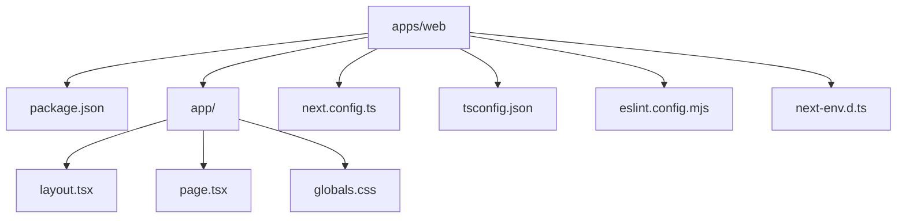

# Web App File Guide

This guide explains the most important files inside `apps/web`.

## File Map

## `apps/web/package.json`

This file describes the web workspace itself.

It tells npm:

- the workspace name
- which scripts exist
- which packages the app depends on

In this project, the most important scripts are:

- `dev`: start the local development server
- `build`: create a production build
- `start`: run the production server
- `lint`: run ESLint on the app

## `apps/web/app/`

This is the main application folder for the App Router.

In Next.js App Router projects, folders and files inside `app/` define what the
user can visit and how pages are wrapped.

## `apps/web/app/layout.tsx`

This is the root layout.

Think of it as the outer shell for the app. It wraps every page and is a common
place to put:

- the `<html>` and `<body>` tags
- shared navigation
- shared metadata like the page title
- global providers later on

In this repository, it also imports the global stylesheet.

## `apps/web/app/page.tsx`

This file defines the home page at `/`.

When someone opens the site, this component is what they see first.

If you want to change the homepage content, this is one of the first files to
edit.

## `apps/web/app/globals.css`

This file contains styles that apply across the app.

Right now it defines:

- the color palette
- the page background
- typography
- the hero section layout

Global CSS is useful for broad styling, while smaller components can later have
their own styles if the app grows.

## `apps/web/next.config.ts`

This is where Next.js project-level configuration lives.

It is currently minimal, which is fine for a small starter app. Later, this is
where you might add options for images, redirects, headers, or experimental
features.

## `apps/web/tsconfig.json`

This file configures TypeScript for the web app.

It extends the root `tsconfig.base.json`, which lets the monorepo share common
TypeScript settings.

That setup is useful because multiple apps or packages can follow the same base
rules without copying configuration everywhere.

## `apps/web/eslint.config.mjs`

This file tells ESLint how to lint the app.

Linting does not run the app. Instead, it checks the code for common mistakes
and style issues before those problems become bugs.

## `apps/web/next-env.d.ts`

This file is created for Next.js TypeScript support.

Most of the time, you do not need to edit it manually.
