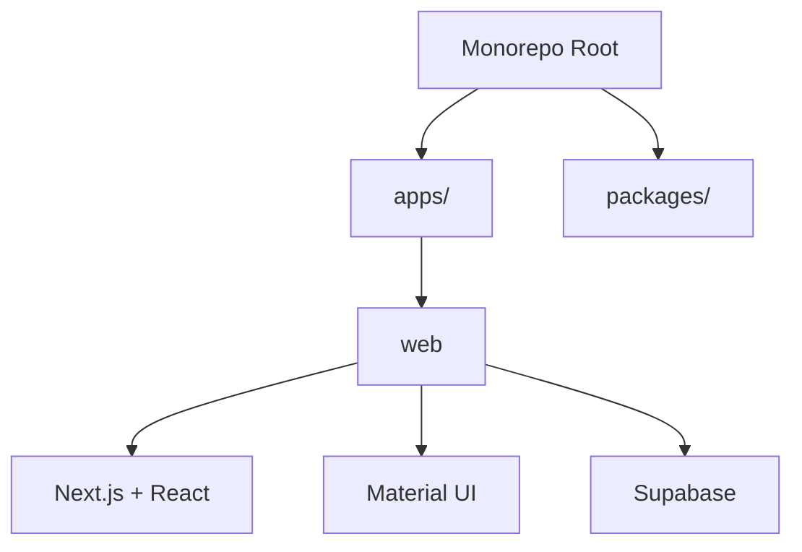
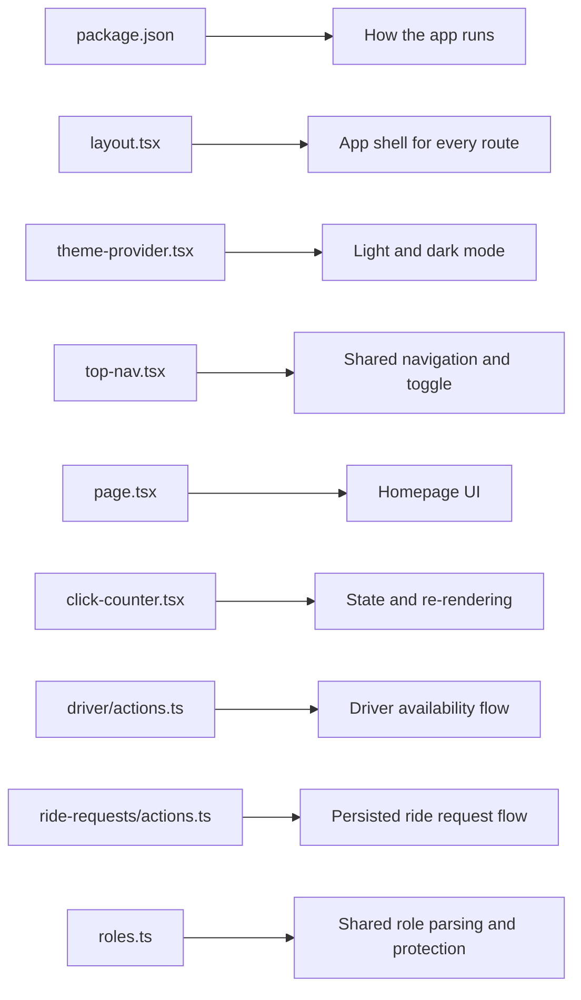

# Web App Overview

The web app lives in `apps/web`.

It is a Next.js app that uses:

- React for components
- App Router for file-based routing
- Material UI for visual components and theming
- Supabase for authentication, user/session work, and role metadata

## How It Fits Into The Monorepo

This repository uses `npm` workspaces. That means one repository can hold
multiple related projects.

Right now the main app is:

- `apps/web`: the Next.js frontend

There is also a place for shared code:

- `packages/`: reusable libraries or UI packages you may add later

## What The App Does Right Now

The project is still early, but the current app already has a few important
pieces:

- a real landing page with image-led product messaging
- a dedicated death statistic section on the landing page
- a matching arrests statistic section on the landing page
- a reusable full-width linear stat visualization with a moving car and countdown
- public pages such as Home, About, and Contact
- auth pages for sign up and sign in
- a protected dashboard page
- self-serve role toggles for `patron`, `concierge`, and `driver`
- signed-in role sections for patrons, concierges, and drivers
- driver availability with location and radius
- persisted ride requests for patrons and concierges
- driver opportunities backed by saved ride requests
- map-based UI for driver coverage and rider-side nearby-driver lookup
- map-based pickup selection for concierge-created requests
- duplicate-request guardrails for active rider-side requests
- lifecycle tracking for claimed, completed, and cancelled requests
- an admin-only page
- a shared top navigation
- a light and dark theme toggle
- Supabase helpers for browser, server, and admin work

## Main Commands

From the repository root:

- `npm install`: installs dependencies for the whole monorepo
- `npm run dev`: starts the web app in development mode
- `npm run build`: creates a production build
- `npm run lint`: checks the web app for common code-quality issues
- `npm test`: runs the Vitest suite for the web app
- `npm run coverage`: runs tests with enforced coverage thresholds

From the `web` workspace:

- `npm run make-admin --workspace web -- user@example.com`: grants the admin
  role to an existing Supabase user
- `npm run db:types --workspace web`: regenerates the Supabase TypeScript types

## A Good Beginner Path

If you want to learn this project step by step, this is a useful path:

1. `apps/web/package.json`
2. `apps/web/app/layout.tsx`
3. `apps/web/app/theme-provider.tsx`
4. `apps/web/app/components/top-nav.tsx`
5. `apps/web/app/page.tsx`
6. `apps/web/app/components/page-header.tsx`
7. `apps/web/app/components/click-counter.tsx`
8. `apps/web/lib/supabase/server.ts`
9. `apps/web/app/driver/actions.ts`
10. `apps/web/app/ride-requests/actions.ts`
11. `apps/web/lib/roles.ts`

That path shows:

- how the app is configured
- how every page is wrapped
- how theme state is shared
- how navigation works
- how a page is built from smaller components
- how client-side state works
- how server-side auth checks work
- how persisted availability is stored
- how ride requests move through the app
- how maps now support all three active role workflows
- how basic MVP guardrails keep the workflow from becoming noisy
- how shared role helpers turn auth metadata into app-level permissions

## Visual Learning Map

## Source Files And Generated Files

It helps to separate the app into two groups.

### Source files you edit

- `app/`
- `lib/`
- `scripts/`
- `eslint.config.mjs`
- `next-env.d.ts`
- `next.config.ts`
- `package.json`
- `tsconfig.json`

### Generated files and folders you usually do not edit

- `.next/`: build and dev-server output created by Next.js
- `tsconfig.tsbuildinfo`: TypeScript incremental build cache

Most day-to-day work happens in the source files. The generated files exist so
the framework and tooling can run faster.
