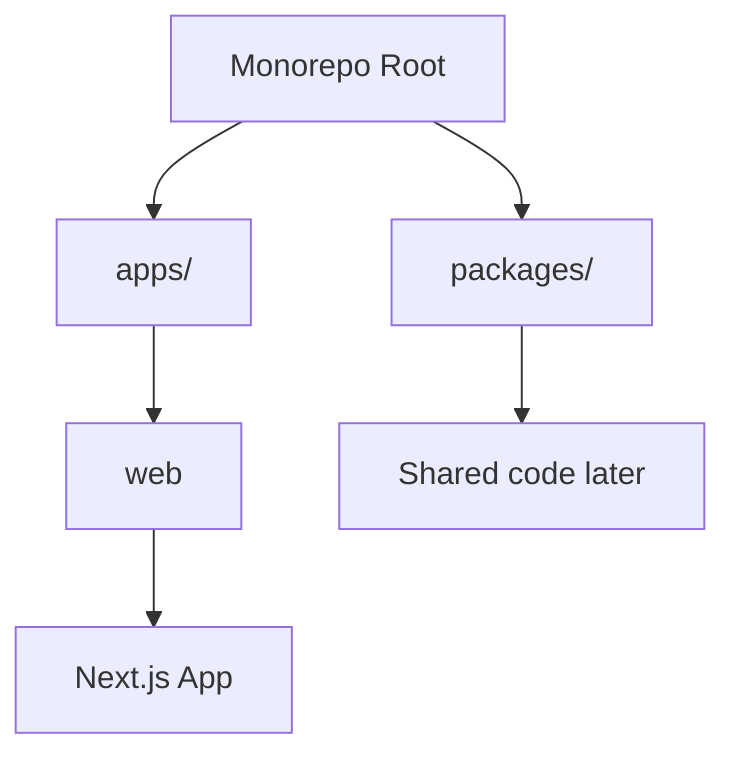
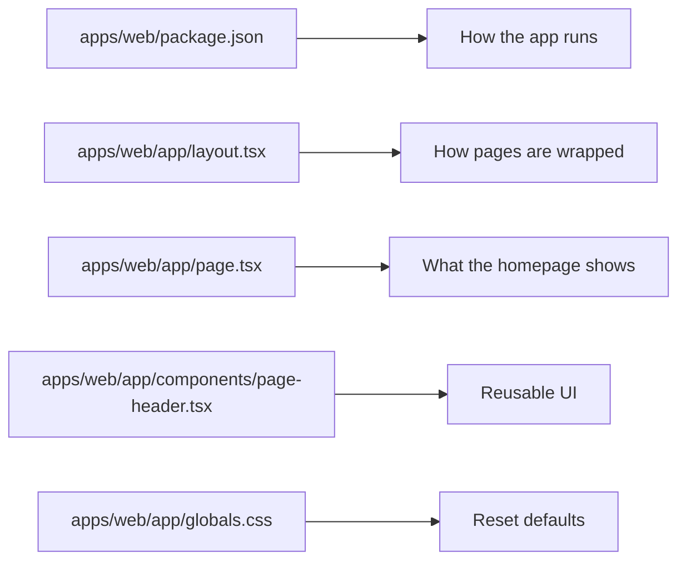

# Web App Overview

The web app lives in `apps/web`.

It is a [Next.js](https://nextjs.org/) application, which means it uses React
to build user interfaces and Next.js to handle routing, building, and serving
the site.

## How It Fits Into The Monorepo

This repository uses `npm` workspaces. That means one repository can contain
multiple related projects.

Right now there is one application:

- `apps/web`: the Next.js frontend

There is also a place for shared code:

- `packages/`: reusable libraries, UI components, or helpers you may add later

## What This App Does Right Now

At the moment, the app is a small starter site. It includes:

- a root layout
- a home page
- a small reusable component
- a global stylesheet with only reset defaults
- TypeScript configuration
- Next.js configuration
- ESLint configuration
- generated build output in `.next/` after you run the app or build it

This gives you a solid starting point without a lot of extra complexity.

## Main Commands

From the repository root:

- `npm install`: installs dependencies for the whole monorepo
- `npm run dev`: starts the web app in development mode
- `npm run build`: creates a production build
- `npm run lint`: checks the web app for common code-quality issues

## A Good Beginner Path

If you want to learn this project step by step, read the files in this order:

1. `apps/web/package.json`
2. `apps/web/app/layout.tsx`
3. `apps/web/app/page.tsx`
4. `apps/web/app/components/page-header.tsx`
5. `apps/web/app/globals.css`

That path helps you see:

- how the app is configured
- how the page is wrapped
- what the homepage renders
- how the reusable heading component works
- which global defaults exist across the app

## Visual Learning Map

## Source Files And Generated Files

It helps to separate the app into two groups:

### Source files you edit

- `app/`
- `eslint.config.mjs`
- `next-env.d.ts`
- `next.config.ts`
- `package.json`
- `tsconfig.json`

### Generated output you usually do not edit

- `.next/`: build and dev-server output created by Next.js
- `tsconfig.tsbuildinfo`: TypeScript incremental build cache

The docs in this folder describe both groups, but the source files are the ones
you will usually work in day to day.
