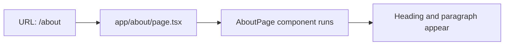

# About Page Guide

This guide explains `apps/web/app/about/page.tsx` line by line.

## The Full File

```tsx
import PageHeader from "../components/page-header";

export default function AboutPage() {
  return (
    <main>
      <section>
        <PageHeader heading="About" />
        <p>This is the about page for the Designated web app.</p>
      </section>
    </main>
  );
}
```

## What This File Does

This file defines the `/about` page.

Because the file lives at `app/about/page.tsx`, Next.js maps it to the URL
`/about`.

## Line By Line

## `import PageHeader from "../components/page-header";`

This imports the `PageHeader` component.

The `../` means "go up one folder first."

That is needed because this file lives in `app/about/`, while the component
lives in `app/components/`.

## `export default function AboutPage() {`

This defines the React component for the About page.

Next.js uses this default export as the page component for `/about`.

## `<main>`

This marks the main content area for the page.

## `<section>`

This groups the content of the page together.

## `<PageHeader heading="About" />`

This renders a heading component and passes `"About"` as the `heading` prop.

## `<p>This is the about page for the Designated web app.</p>`

This renders a paragraph of text under the heading.

The paragraph is plain JSX and does not use a separate component.

## How React Uses This File

When someone visits `/about`:

1. Next.js finds `app/about/page.tsx`
2. React runs `AboutPage`
3. the component returns JSX
4. the browser shows the heading and paragraph

## Route Diagram


