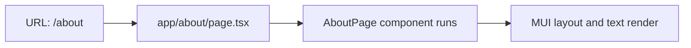

# About Page Guide

This guide explains `apps/web/app/about/page.tsx` line by line.

## The Full File

```tsx
import Container from "@mui/material/Container";
import Paper from "@mui/material/Paper";
import Stack from "@mui/material/Stack";
import Typography from "@mui/material/Typography";
import PageHeader from "../components/page-header";

export default function AboutPage() {
  return (
    <Container component="main" maxWidth="md" sx={{ py: 4 }}>
      <Paper sx={{ p: 4 }}>
        <Stack spacing={2}>
          <PageHeader heading="About" />
          <Typography>
            This is the about page for the Designated web app.
          </Typography>
        </Stack>
      </Paper>
    </Container>
  );
}
```

## What This File Does

This file defines the `/about` page.

Because the file lives at `app/about/page.tsx`, Next.js maps it to the URL
`/about`.

## Line By Line

## `import Container ... Typography ...`

These imports bring in Material UI layout and text components.

## `import PageHeader from "../components/page-header";`

This imports the shared heading component from the `components/` folder.

## `export default function AboutPage() {`

This defines the React component for the About page.

Next.js uses this default export as the page component for `/about`.

## `<Container component="main" maxWidth="md" sx={{ py: 4 }}>`

This creates the centered outer page wrapper.

## `<Paper sx={{ p: 4 }}>`

This creates the main surface around the content.

## `<Stack spacing={2}>`

This vertically arranges the heading and paragraph with spacing between them.

## `<PageHeader heading="About" />`

This renders the reusable heading component.

## `<Typography> ... </Typography>`

This renders the body text for the page using Material UI typography styling.

## Route Diagram


