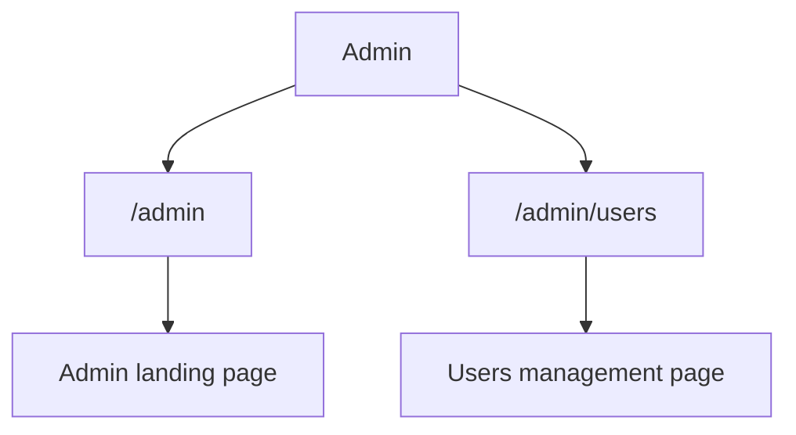

# Admin Page Guide

This guide explains `apps/web/app/admin/page.tsx` line by line.

## The Full File

```tsx
import Stack from "@mui/material/Stack";
import Typography from "@mui/material/Typography";
import DashboardShell from "../components/dashboard-shell";
import PageHeader from "../components/page-header";
import { requireAdminUser } from "../../lib/admin-access";

export default async function AdminPage() {
  const user = await requireAdminUser();

  return (
    <DashboardShell>
      <Stack spacing={2}>
        <PageHeader heading="Admin" />
        <Typography>Welcome to the admin page.</Typography>
        <Typography>Signed in as: {user.email}</Typography>
        <Typography>
          Use the admin section in the left navigation to manage users.
        </Typography>
      </Stack>
    </DashboardShell>
  );
}
```

## What This File Does

This file renders the `/admin` page.

It is the landing page for the admin section and sits above the nested `Users`
page in the admin subsection of the left nav.

## Key Ideas

- the page is protected by `requireAdminUser()`
- the page uses the shared dashboard shell
- the left nav treats `Admin` as a parent item
- the admin subsection can expand to show `Users`

## Admin Section Diagram


