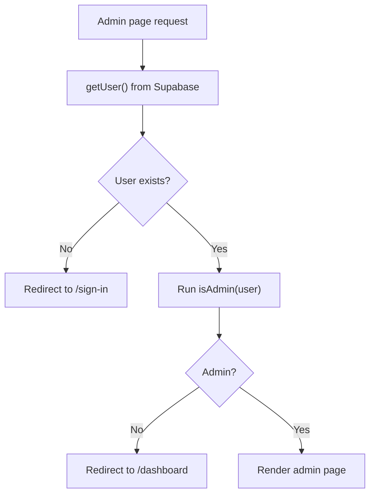

# Admin Page Guide

This guide explains `apps/web/app/admin/page.tsx` line by line.

## The Full File

```tsx
import type { User } from "@supabase/supabase-js";
import { redirect } from "next/navigation";
import Container from "@mui/material/Container";
import Paper from "@mui/material/Paper";
import Stack from "@mui/material/Stack";
import Typography from "@mui/material/Typography";
import PageHeader from "../components/page-header";
import { createClient } from "../../lib/supabase/server";

function isAdmin(user: User) {
  const metadata = (user.app_metadata ?? {}) as {
    role?: unknown;
    roles?: unknown;
  };
  const role = metadata.role;
  const roles = metadata.roles;

  if (role === "admin") {
    return true;
  }

  return Array.isArray(roles) && roles.includes("admin");
}

export default async function AdminPage() {
  const supabase = await createClient();
  const {
    data: { user }
  } = await supabase.auth.getUser();

  if (!user) {
    redirect("/sign-in?message=Please sign in to view the admin page.");
  }

  if (!isAdmin(user)) {
    redirect("/dashboard?message=Admin access required.");
  }

  return (
    <Container component="main" maxWidth="md" sx={{ py: 4 }}>
      <Paper sx={{ p: 4 }}>
        <Stack spacing={2}>
          <PageHeader heading="Admin" />
          <Typography>Welcome to the admin page.</Typography>
          <Typography>Signed in as: {user.email}</Typography>
        </Stack>
      </Paper>
    </Container>
  );
}
```

## What This File Does

This file renders the `/admin` page.

It protects the page in two steps:

- the user must be signed in
- the signed-in user must have the `admin` role in Supabase `app_metadata`

## Line By Line

## `import type { User } from "@supabase/supabase-js";`

This imports the Supabase `User` type for TypeScript.

## `import { redirect } from "next/navigation";`

This imports the server-side redirect helper from Next.js.

## `import Container ... Typography ...`

These imports bring in Material UI layout and text components.

## `import { createClient } from "../../lib/supabase/server";`

This imports the server-side Supabase helper.

The admin page needs this because the auth check runs on the server.

## `function isAdmin(user: User) { ... }`

This helper function checks whether the user should count as an admin.

Keeping this logic in a small helper makes the page easier to read.

## `const metadata = (user.app_metadata ?? {}) as { ... };`

This reads the `app_metadata` object from the Supabase user.

`?? {}` means:

- if `app_metadata` exists, use it
- otherwise, use an empty object

The `as { ... }` part tells TypeScript which keys we expect might exist.

## `const role = metadata.role;`

This reads a single-role value if one exists.

## `const roles = metadata.roles;`

This reads a multi-role value if one exists.

That means the app supports both:

- `role: "admin"`
- `roles: ["admin", ...]`

## `if (role === "admin") { return true; }`

This is the simplest admin check.

If the user has a single `role` value of `"admin"`, the helper returns `true`.

## `return Array.isArray(roles) && roles.includes("admin");`

If the single-role check did not pass, this line checks the array version.

It first confirms that `roles` is really an array, then checks whether the
array contains `"admin"`.

## `const supabase = await createClient();`

This creates the server-side Supabase client.

## `const { data: { user } } = await supabase.auth.getUser();`

This asks Supabase for the current user.

## `if (!user) { redirect("/sign-in?..."); }`

This is the first protection step.

Unsigned visitors are sent to the sign-in page.

## `if (!isAdmin(user)) { redirect("/dashboard?..."); }`

This is the second protection step.

Signed-in users who are not admins are redirected away from the admin page.

## `<Container ...>`, `<Paper ...>`, `<Stack ...>`

These create the page’s MUI layout structure.

## `<PageHeader heading="Admin" />`

This shows the page heading.

## `<Typography>Welcome to the admin page.</Typography>`

This shows a simple welcome message.

## `<Typography>Signed in as: {user.email}</Typography>`

This shows the admin user’s email address.

## Admin Protection Flow


