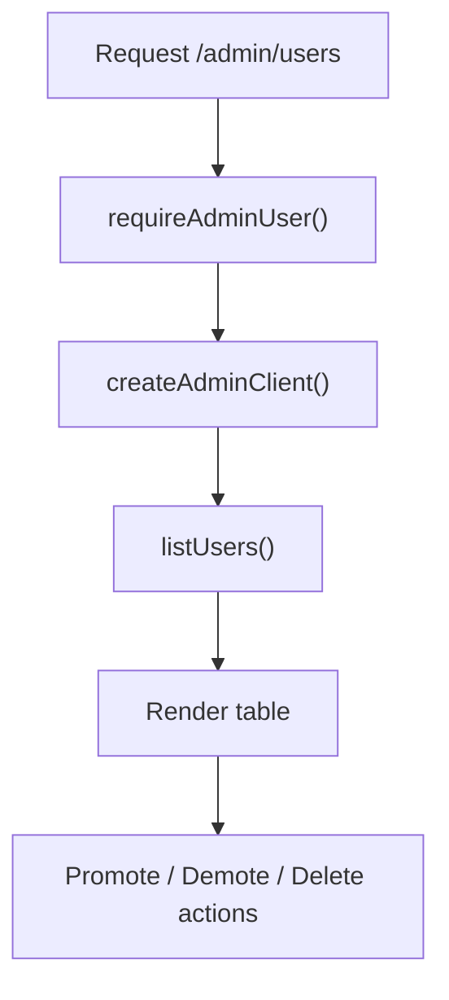

# Admin Users Page Guide

This guide explains `apps/web/app/admin/users/page.tsx` line by line.

## What This File Does

This file renders `/admin/users`.

It is an admin-only page that loads signed-up users from Supabase and displays
management actions for each user.

## What The Page Shows

- each user’s email
- each user’s id
- whether the user is an admin
- whether the user has confirmed email
- action buttons for promote, demote, and delete

## Important Ideas

- the page uses `requireAdminUser()` before doing anything else
- it uses `createAdminClient()` because listing all users is an admin-only API
- each action button is a form connected to a server action
- the current admin cannot demote or delete themselves

## Users Page Flow

