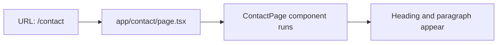

# Contact Page Guide

This guide explains `apps/web/app/contact/page.tsx` line by line.

## The Full File

```tsx
import PageHeader from "../components/page-header";

export default function ContactPage() {
  return (
    <main>
      <section>
        <PageHeader heading="Contact" />
        <p>This is the contact page for the Designated web app.</p>
      </section>
    </main>
  );
}
```

## What This File Does

This file defines the `/contact` page.

Because the file lives at `app/contact/page.tsx`, Next.js maps it to the URL
`/contact`.

## Line By Line

## `import PageHeader from "../components/page-header";`

This imports the shared `PageHeader` component from the `components/` folder.

## `export default function ContactPage() {`

This defines the React component for the Contact page.

## `<main>`

This marks the primary content area of the page.

## `<section>`

This groups the heading and paragraph together.

## `<PageHeader heading="Contact" />`

This renders the shared heading component with the text `"Contact"`.

## `<p>This is the contact page for the Designated web app.</p>`

This renders a simple paragraph under the heading.

## How React Uses This File

When a user visits `/contact`:

1. Next.js matches the URL to `app/contact/page.tsx`
2. React runs `ContactPage`
3. JSX is returned
4. the browser shows the final page

## Route Diagram


