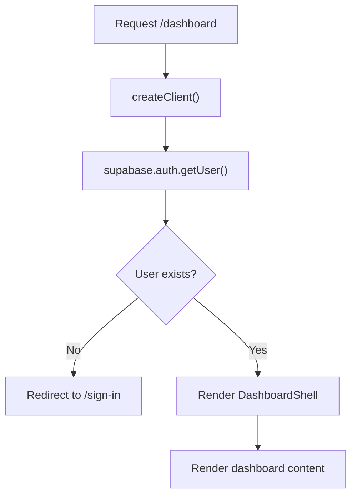

# Dashboard Page Guide

This guide explains `apps/web/app/dashboard/page.tsx` line by line.

## The Full File

```tsx
import { redirect } from "next/navigation";
import Button from "@mui/material/Button";
import Stack from "@mui/material/Stack";
import Typography from "@mui/material/Typography";
import AuthMessage from "../components/auth-message";
import PageHeader from "../components/page-header";
import DashboardShell from "../components/dashboard-shell";
import { signOut } from "../auth/actions";
import { createClient } from "../../lib/supabase/server";

export default async function DashboardPage({
  searchParams
}: {
  searchParams: Promise<{ message?: string }>;
}) {
  const supabase = await createClient();
  const { message } = await searchParams;
  const {
    data: { user }
  } = await supabase.auth.getUser();

  if (!user) {
    redirect("/sign-in?message=Please sign in to view the dashboard.");
  }

  return (
    <DashboardShell>
      <Stack spacing={3}>
        <PageHeader heading="Dashboard" />
        <AuthMessage message={message} />
        <Typography>Signed in as: {user.email}</Typography>
        <Stack component="form" action={signOut}>
          <Button type="submit" variant="outlined">
            Sign Out
          </Button>
        </Stack>
      </Stack>
    </DashboardShell>
  );
}
```

## What This File Does

This file renders the protected `/dashboard` page.

If there is no signed-in user, it redirects to `/sign-in`.

## What Makes It Special

This page is the main entry into the app-area shell.

That means it is not just a page with content. It also lives inside the shared
left-navigation layout used by dashboard and admin pages.

## Page Flow Diagram


