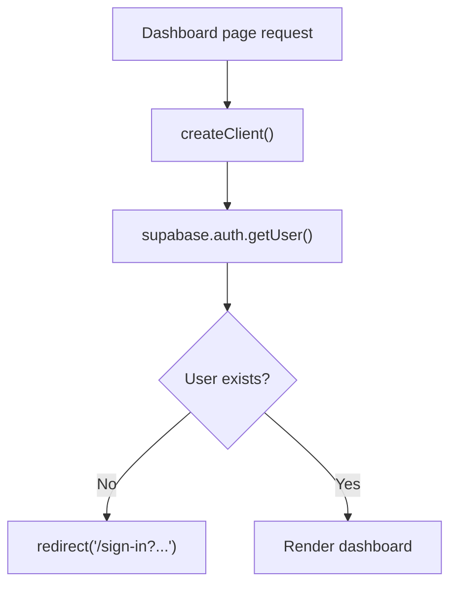

# Dashboard Page Guide

This guide explains `apps/web/app/dashboard/page.tsx` line by line.

## The Full File

```tsx
import { redirect } from "next/navigation";
import Button from "@mui/material/Button";
import Container from "@mui/material/Container";
import Paper from "@mui/material/Paper";
import Stack from "@mui/material/Stack";
import Typography from "@mui/material/Typography";
import AuthMessage from "../components/auth-message";
import PageHeader from "../components/page-header";
import { signOut } from "../auth/actions";
import { createClient } from "../../lib/supabase/server";

export default async function DashboardPage({
  searchParams
}: {
  searchParams: Promise<{ message?: string }>;
}) {
  const supabase = await createClient();
  const { message } = await searchParams;
  const {
    data: { user }
  } = await supabase.auth.getUser();

  if (!user) {
    redirect("/sign-in?message=Please sign in to view the dashboard.");
  }

  return (
    <Container component="main" maxWidth="md" sx={{ py: 4 }}>
      <Paper sx={{ p: 4 }}>
        <Stack spacing={3}>
          <PageHeader heading="Dashboard" />
          <AuthMessage message={message} />
          <Typography>Signed in as: {user.email}</Typography>
          <Stack component="form" action={signOut}>
            <Button type="submit" variant="outlined">
              Sign Out
            </Button>
          </Stack>
        </Stack>
      </Paper>
    </Container>
  );
}
```

## What This File Does

This file renders the protected `/dashboard` page.

If there is no signed-in user, it redirects to `/sign-in`.

## Line By Line

## `import { redirect } from "next/navigation";`

This imports Next.js navigation redirection for server-side use.

It lets the page stop rendering and send the user to a different route.

## `import Button ... Typography ...`

These imports bring in Material UI UI pieces for the page layout.

## `import { signOut } from "../auth/actions";`

This imports the server action used by the sign-out form.

## `import { createClient } from "../../lib/supabase/server";`

This imports the server-side Supabase client helper.

That helper is the safe choice for a server component like this page.

## `const supabase = await createClient();`

This creates a Supabase client for the current server request.

## `const { message } = await searchParams;`

This reads an optional query-string message from the URL.

The page uses that message to show things like "Admin access required."

## `const { data: { user } } = await supabase.auth.getUser();`

This asks Supabase for the current signed-in user.

If there is a valid authenticated session, `user` will contain user data.

If there is no valid session, `user` will be `null`.

## `if (!user) { redirect(...); }`

This protects the page.

If there is no signed-in user, the page redirects to sign in instead of showing
dashboard content.

## `<Container component="main" maxWidth="md" sx={{ py: 4 }}>`

This creates the centered outer page wrapper.

## `<Paper sx={{ p: 4 }}>`

This creates the main card-like surface.

## `<Stack spacing={3}>`

This creates vertical spacing between the child elements.

## `<PageHeader heading="Dashboard" />`

This shows the page title.

## `<AuthMessage message={message} />`

This shows an optional informational alert.

## `<Typography>Signed in as: {user.email}</Typography>`

This prints the signed-in user’s email address.

## `<Stack component="form" action={signOut}>`

This renders a real form that submits to the `signOut` server action.

## `<Button type="submit" variant="outlined">`

This renders the sign-out button.

`variant="outlined"` gives it a lighter visual style than the filled buttons on
the auth pages.

## Dashboard Protection Flow


