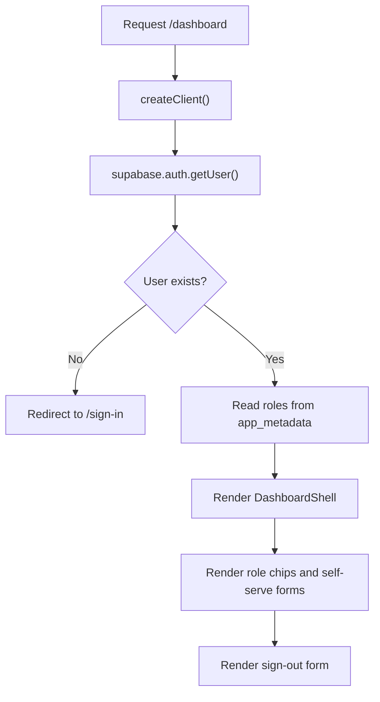

# Dashboard Page Guide

This guide explains `apps/web/app/dashboard/page.tsx` line by line.

## The Full File

```tsx
import { redirect } from "next/navigation";
import Button from "@mui/material/Button";
import Chip from "@mui/material/Chip";
import Stack from "@mui/material/Stack";
import Typography from "@mui/material/Typography";
import AuthMessage from "../components/auth-message";
import PageHeader from "../components/page-header";
import DashboardShell from "../components/dashboard-shell";
import { disableSelfRole, enableSelfRole } from "./actions";
import { signOut } from "../auth/actions";
import { SELF_ASSIGNABLE_ROLES, getRoles } from "../../lib/roles";
import { createClient } from "../../lib/supabase/server";

export default async function DashboardPage({
  searchParams
}: {
  searchParams: Promise<{ message?: string }>;
}) {
  const supabase = await createClient();
  const { message } = await searchParams;
  const {
    data: { user }
  } = await supabase.auth.getUser();

  if (!user) {
    redirect("/sign-in?message=Please sign in to view the dashboard.");
  }

  const roles = getRoles(user.app_metadata);

  return (
    <DashboardShell>
      <Stack spacing={3}>
        <PageHeader heading="Dashboard" />
        <AuthMessage message={message} />
        <Typography>Signed in as: {user.email}</Typography>
        <Stack spacing={2}>
          <Typography variant="h5">Your Modes</Typography>
          <Typography color="text.secondary">
            For MVP, you can turn patron, concierge, and driver modes on or off for
            yourself here.
          </Typography>
          <Stack direction="row" spacing={1} sx={{ flexWrap: "wrap" }} useFlexGap>
            {roles.length ? (
              roles.map((role) => <Chip key={role} label={role} variant="outlined" />)
            ) : (
              <Chip label="No active modes" variant="outlined" />
            )}
          </Stack>
          <Stack direction={{ xs: "column", sm: "row" }} spacing={1} useFlexGap>
            {SELF_ASSIGNABLE_ROLES.map((role) =>
              roles.includes(role) ? (
                <Stack
                  key={role}
                  component="form"
                  action={disableSelfRole}
                  direction="row"
                >
                  <input name="role" type="hidden" value={role} />
                  <Button color="warning" type="submit" variant="outlined">
                    Turn off {role}
                  </Button>
                </Stack>
              ) : (
                <Stack
                  key={role}
                  component="form"
                  action={enableSelfRole}
                  direction="row"
                >
                  <input name="role" type="hidden" value={role} />
                  <Button type="submit" variant="outlined">
                    Turn on {role}
                  </Button>
                </Stack>
              )
            )}
          </Stack>
        </Stack>
        <Stack component="form" action={signOut}>
          <Button type="submit" variant="outlined">
            Sign Out
          </Button>
        </Stack>
      </Stack>
    </DashboardShell>
  );
}
```

## What This File Does

This file renders the protected `/dashboard` page.

If there is no signed-in user, it redirects to `/sign-in`.

It also acts as the MVP self-serve role page. A signed-in user can see their
current roles and turn `patron`, `concierge`, and `driver` on or off for
themselves.

## What Makes It Special

This page is the main entry into the app-area shell.

That means it is not just a page with content. It also lives inside the shared
left-navigation layout used by dashboard and admin pages.

It is also where the app exposes the flexible role model most clearly. Instead
of assuming a user has one fixed identity forever, the dashboard shows the
active modes attached to the current account.

## Line By Line

## `import Chip from "@mui/material/Chip";`

This imports the Material UI `Chip` component.

The page uses chips to show which modes the signed-in user currently has.

## `import { disableSelfRole, enableSelfRole } from "./actions";`

This imports the dashboard server actions.

Those actions run on the server and update the signed-in user’s role metadata
in Supabase.

## `import { SELF_ASSIGNABLE_ROLES, getRoles } from "../../lib/roles";`

This imports two shared role helpers:

- `SELF_ASSIGNABLE_ROLES` is the list of roles a normal user can manage for
  themselves
- `getRoles` reads `app_metadata` and turns it into a clean array of roles

## `const supabase = await createClient();`

This creates the server-side Supabase client.

Because this page runs on the server, it can safely read the current session.

## `const { message } = await searchParams;`

This reads an optional status message from the URL.

The dashboard uses this to show confirmation text after role changes or other
redirects.

## `const { data: { user } } = await supabase.auth.getUser();`

This asks Supabase for the current signed-in user.

The returned `user` object includes auth information such as email and
`app_metadata`.

## `if (!user) { redirect(...) }`

This protects the page.

If nobody is signed in, the page does not render the dashboard at all. It
redirects the visitor to the sign-in page instead.

## `const roles = getRoles(user.app_metadata);`

This is one of the most important lines in the file.

It reads the signed-in user’s stored role metadata from Supabase and turns it
into a normal array such as:

```ts
["patron", "driver"]
```

That array is then used to decide:

- which chips to show
- which buttons should say `Turn on`
- which buttons should say `Turn off`

## `<DashboardShell>`

This wraps the page in the shared signed-in app layout.

That gives the dashboard the left-side app navigation and the top navigation.

## `<PageHeader heading="Dashboard" />`

This renders the page title.

## `<AuthMessage message={message} />`

This shows any URL message passed back after a redirect.

For example, the role actions redirect back here with success or error text.

## `<Typography>Signed in as: {user.email}</Typography>`

This shows which user account is currently active.

## `<Typography variant="h5">Your Modes</Typography>`

This introduces the self-serve role section.

The app calls these roles “modes” here because one person can have more than
one of them at the same time.

## `<Typography color="text.secondary"> ... </Typography>`

This explains the MVP rule directly to the user:

- they can manage `patron`
- they can manage `concierge`
- they can manage `driver`

without needing admin approval.

## `<Stack direction="row" ...>`

This row renders the current role chips.

If the user has roles, the page maps through them and shows one chip per role.
If not, it shows a fallback chip that says `No active modes`.

## `SELF_ASSIGNABLE_ROLES.map(...)`

This loops over the allowed self-managed roles.

For each role, the page asks:

- does the user already have this role?

If yes, the page renders a form with a `Turn off` button.

If no, the page renders a form with a `Turn on` button.

## `<input name="role" type="hidden" value={role} />`

This hidden field is how the form tells the server action which role to change.

The user never types into this field manually. It is part of the form payload
submitted behind the scenes.

## `action={disableSelfRole}` and `action={enableSelfRole}`

These connect the small forms directly to server actions.

That means:

1. the user clicks a button
2. Next.js sends the form data to the server
3. the server action updates Supabase auth metadata
4. the server redirects back to `/dashboard` with a message

## `<Stack component="form" action={signOut}>`

This is a separate form for signing out.

The dashboard keeps it simple: role management first, then sign out.

## Page Flow Diagram


