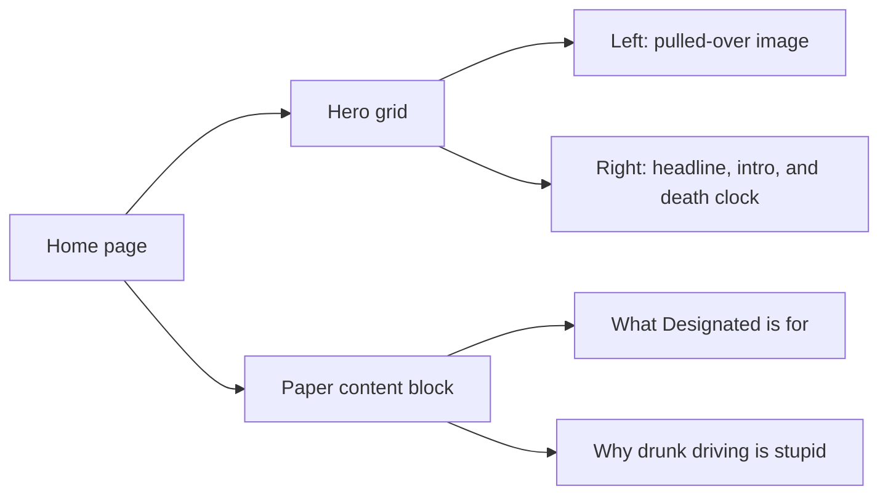

# Home Page Guide

This guide explains `apps/web/app/page.tsx` line by line.

## What This File Does

This file defines the homepage route at `/`.

It now acts like a real landing page instead of a starter screen.

The page has two main parts:

- an above-the-fold hero area with an image on the left and headline/copy on
  the right
- a lower content card with longer explanation sections

## Key Ideas

- `next/image` is used for the landing-page image
- the top section uses a responsive two-column grid
- the image stacks above the text on smaller screens
- the hero also includes a small statistical death clock component
- the `Paper` below the hero holds the longer explanation content

## Hero Layout Diagram

## Current Structure

The hero area contains:

- the `pulled-over.jpg` image
- the oversized statement `Drunk driving is stupid.`
- the supporting paragraph that introduces *Designated*
- the small statistical death clock

The lower content card contains:

- a section explaining what Designated is for
- a section explaining why drunk driving is stupid

## Why This Page Matters

For a beginner, this file is a good example of how one page can combine:

- layout
- typography
- image assets
- product messaging
- responsive design

all in one place.
