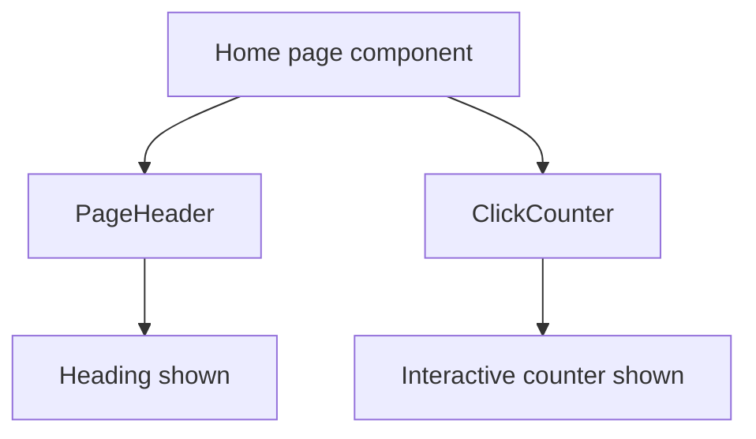

# Home Page Guide

This guide explains `apps/web/app/page.tsx` line by line.

## The Full File

```tsx
import PageHeader from "./components/page-header";
import ClickCounter from "./components/click-counter";

export default function Home() {
  return (
    <main>
      <section>
        <PageHeader heading="Designated" />
        <ClickCounter />
      </section>
    </main>
  );
}
```

## What This File Does

This file defines the homepage route at `/`.

When a user visits the root URL of the site, Next.js renders this component.

## Line By Line

## `import PageHeader from "./components/page-header";`

This imports the `PageHeader` component from the local `components/` folder.

The `./` means "start from the current folder."

This component is used to show the page heading.

## `import ClickCounter from "./components/click-counter";`

This imports the `ClickCounter` component.

The homepage uses it to show a small interactive example.

## `export default function Home() {`

This defines the React component for the homepage.

Because it is the default export, Next.js can use it as the page for `/`.

## `return ( ... )`

The component returns JSX.

JSX describes what should appear on the page.

## `<main>`

The `<main>` element represents the main content area of the page.

It helps give the page semantic structure.

## `<section>`

The `<section>` element groups related content together.

In this file, it groups the heading and the click counter.

## `<PageHeader heading="Designated" />`

This renders the `PageHeader` component.

The `heading` prop passes the text `"Designated"` into that component.

That is how the component knows what heading to show.

## `<ClickCounter />`

This renders the `ClickCounter` component.

Unlike `PageHeader`, it does not need props right now.

It manages its own state internally.

## `);` and `}`

These close the JSX, the `return`, and the component function.

## How React Uses This File

When React renders this component:

1. it runs the `Home` function
2. it sees that the function returns JSX
3. it renders `PageHeader`
4. it renders `ClickCounter`
5. the browser shows the result

## Component Relationship Diagram


