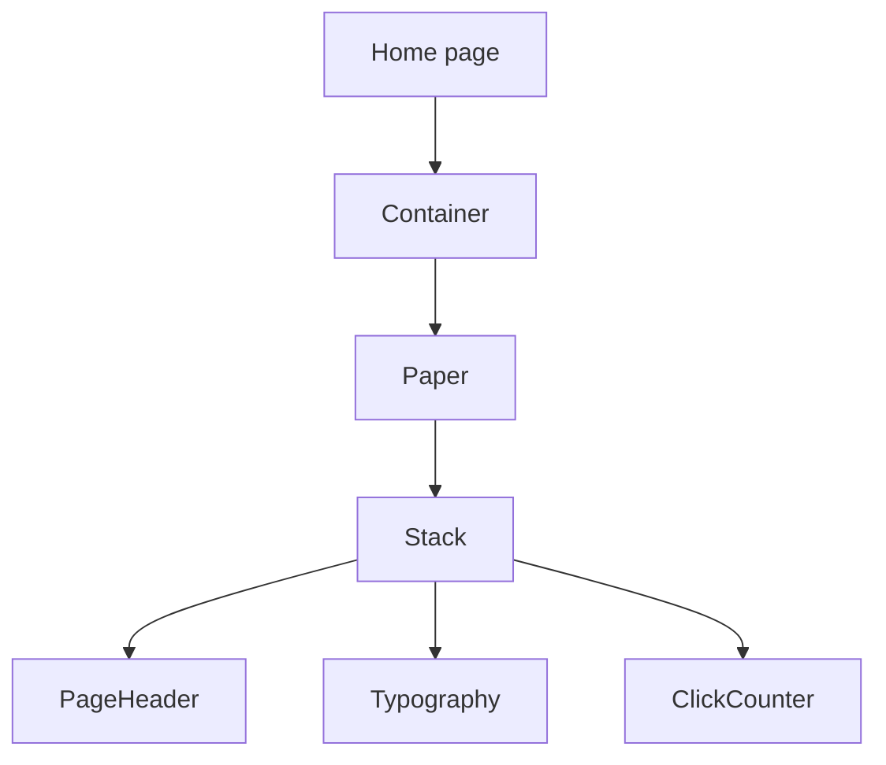

# Home Page Guide

This guide explains `apps/web/app/page.tsx` line by line.

## The Full File

```tsx
import Container from "@mui/material/Container";
import Paper from "@mui/material/Paper";
import Stack from "@mui/material/Stack";
import Typography from "@mui/material/Typography";
import PageHeader from "./components/page-header";
import ClickCounter from "./components/click-counter";

export default function Home() {
  return (
    <Container component="main" maxWidth="md" sx={{ py: 4 }}>
      <Paper sx={{ p: 4 }}>
        <Stack spacing={3}>
          <PageHeader heading="Designated" />
          <Typography>
            Supabase client helpers are set up for this Next.js app.
          </Typography>
          <ClickCounter />
        </Stack>
      </Paper>
    </Container>
  );
}
```

## What This File Does

This file defines the homepage route at `/`.

When someone visits the root URL of the site, Next.js renders this component.

## Line By Line

## `import Container ... Paper ... Stack ... Typography ...`

These imports bring in Material UI layout and text components:

- `Container`: centers content and limits width
- `Paper`: a surface container
- `Stack`: lays out items with spacing
- `Typography`: styled text

## `import PageHeader ... ClickCounter ...`

These imports bring in local reusable components from the `components/` folder.

## `export default function Home() {`

This defines the React component for the homepage.

Because it is the default export in `app/page.tsx`, Next.js uses it as the page
for `/`.

## `<Container component="main" maxWidth="md" sx={{ py: 4 }}>`

This creates the outer page wrapper.

Important props:

- `component="main"`: render the underlying HTML as `<main>`
- `maxWidth="md"`: limit the content width
- `sx={{ py: 4 }}`: add vertical padding

## `<Paper sx={{ p: 4 }}>`

This creates a Material UI surface box around the content.

`sx={{ p: 4 }}` adds padding on all sides.

## `<Stack spacing={3}>`

This creates a simple vertical layout.

Each child inside it gets spacing from the next child.

## `<PageHeader heading="Designated" />`

This renders the shared heading component with the text `"Designated"`.

## `<Typography> ... </Typography>`

This renders a short paragraph explaining that Supabase helpers are already set
up.

## `<ClickCounter />`

This renders the interactive click counter.

That gives the page a small client-side React example.

## Component Relationship Diagram


