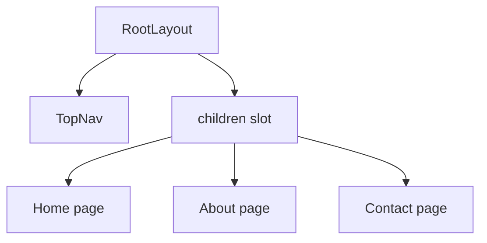

# Root Layout Guide

This guide explains `apps/web/app/layout.tsx` line by line.

## The Full File

```tsx
import type { Metadata } from "next";
import TopNav from "./components/top-nav";
import "./globals.css";

export const metadata: Metadata = {
  title: "Designated",
  description: "A Next.js app inside an npm monorepo."
};

export default function RootLayout({
  children
}: Readonly<{
  children: React.ReactNode;
}>) {
  return (
    <html lang="en">
      <body>
        <TopNav />
        {children}
      </body>
    </html>
  );
}
```

## What This File Does

This file defines the root layout for the app.

Unlike `page.tsx`, a layout does not create its own URL.

Instead, it wraps pages. In this app, it wraps `/`, `/about`, and `/contact`.

## Line By Line

## `import type { Metadata } from "next";`

This imports the `Metadata` type from Next.js.

The word `type` means this import is only used for TypeScript checking.

## `import TopNav from "./components/top-nav";`

This imports the shared top navigation component.

Because the layout renders `TopNav`, the navigation appears on every page that
uses this layout.

## `import "./globals.css";`

This imports the global stylesheet.

That makes the global CSS rules available across the app.

## `export const metadata: Metadata = { ... }`

This defines page metadata for the app, such as the title and description.

Next.js uses this information for the document head.

## `export default function RootLayout({ children }: ...)`

This defines the root layout component.

The `children` prop means "whatever page content should appear inside this
layout."

## `Readonly<{ children: React.ReactNode; }>`

This is a TypeScript type for the props.

It says:

- there is a `children` prop
- it can hold React-renderable content
- the prop object should not be changed inside the function

## `<html lang="en">`

This creates the root HTML element for the document and sets the language to
English.

## `<body>`

This creates the document body.

Everything users see on the page is rendered inside it.

## `<TopNav />`

This renders the shared navigation at the top.

Because it is inside the layout, it appears on every page that the layout
wraps.

## `{children}`

This is where the current page gets inserted.

If the current route is `/about`, then the About page content is rendered here.

If the current route is `/contact`, then the Contact page content is rendered
here.

## Layout Diagram


