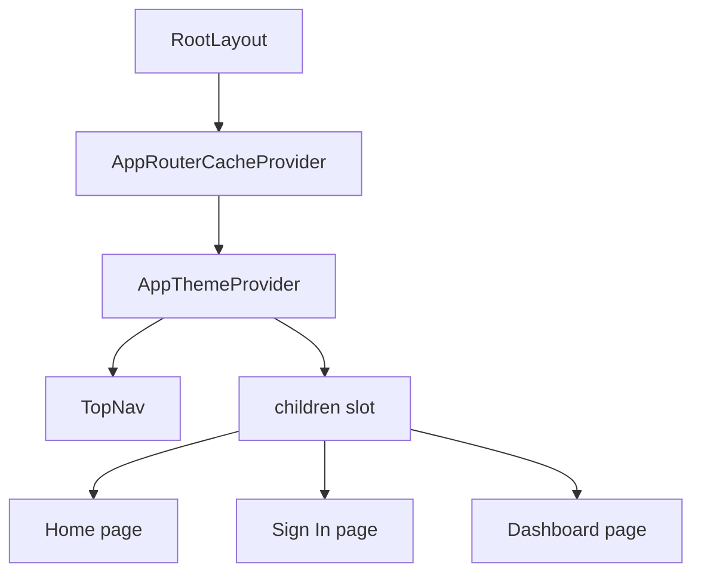

# Root Layout Guide

This guide explains `apps/web/app/layout.tsx` line by line.

## The Full File

```tsx
import type { Metadata } from "next";
import { AppRouterCacheProvider } from "@mui/material-nextjs/v15-appRouter";
import TopNav from "./components/top-nav";
import AppThemeProvider from "./theme-provider";
import "./globals.css";

export const metadata: Metadata = {
  title: "Designated",
  description: "A Next.js app inside an npm monorepo."
};

export default function RootLayout({
  children
}: Readonly<{
  children: React.ReactNode;
}>) {
  return (
    <html lang="en">
      <body>
        <AppRouterCacheProvider>
          <AppThemeProvider>
            <TopNav />
            {children}
          </AppThemeProvider>
        </AppRouterCacheProvider>
      </body>
    </html>
  );
}
```

## What This File Does

This file defines the root layout for the app.

Unlike `page.tsx`, a layout does not create its own URL.

Instead, it wraps pages. In this app, it wraps every route and installs the
shared providers needed by Material UI.

## Line By Line

## `import type { Metadata } from "next";`

This imports the `Metadata` type from Next.js.

The word `type` means the import is only used for TypeScript checking.

## `import { AppRouterCacheProvider } from "@mui/material-nextjs/v15-appRouter";`

This imports Material UI’s App Router cache provider.

It helps Material UI work correctly with Next.js App Router by managing how
styles are collected and inserted.

## `import TopNav from "./components/top-nav";`

This imports the shared top navigation component.

Because the layout renders `TopNav`, the navigation appears on every page.

## `import AppThemeProvider from "./theme-provider";`

This imports the custom theme provider for the app.

That provider is where the light theme, dark theme, and toggle logic live.

## `import "./globals.css";`

This imports the global stylesheet.

That makes the CSS rules available across the app.

## `export const metadata: Metadata = { ... }`

This defines page metadata such as the title and description.

Next.js uses this information when building the document head.

## `export default function RootLayout({ children }: ...)`

This defines the root layout component.

The `children` prop means "the current page content."

## `<html lang="en">`

This creates the root HTML element for the document and sets the language to
English.

## `<body>`

This creates the document body.

Everything users see appears inside it.

## `<AppRouterCacheProvider>`

This wraps the app in Material UI’s Next.js integration helper.

It is infrastructure code that helps Material UI styles behave correctly in the
App Router environment.

## `<AppThemeProvider>`

This wraps the app in the custom theme provider.

That means all child components can access the current theme and the current
color mode context.

## `<TopNav />`

This renders the shared top navigation.

Because it lives in the layout, it appears above every page.

## `{children}`

This is where the current route’s page gets inserted.

If the current route is `/contact`, the Contact page is rendered here.

If the current route is `/dashboard`, the Dashboard page is rendered here.

## Layout Diagram


