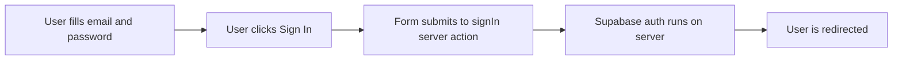

# Sign In Page Guide

This guide explains `apps/web/app/sign-in/page.tsx` line by line.

## The Full File

```tsx
import Link from "next/link";
import Button from "@mui/material/Button";
import Container from "@mui/material/Container";
import Paper from "@mui/material/Paper";
import Stack from "@mui/material/Stack";
import TextField from "@mui/material/TextField";
import Typography from "@mui/material/Typography";
import AuthMessage from "../components/auth-message";
import PageHeader from "../components/page-header";
import { signIn } from "../auth/actions";

export default async function SignInPage({
  searchParams
}: {
  searchParams: Promise<{ message?: string }>;
}) {
  const { message } = await searchParams;

  return (
    <Container component="main" maxWidth="sm" sx={{ py: 4 }}>
      <Paper sx={{ p: 4 }}>
        <Stack spacing={3}>
          <PageHeader heading="Sign In" />
          <AuthMessage message={message} />
          <Stack component="form" action={signIn} spacing={2}>
            <TextField id="email" name="email" type="email" label="Email" required />
            <TextField
              id="password"
              name="password"
              type="password"
              label="Password"
              required
            />
            <Button type="submit" variant="contained">
              Sign In
            </Button>
          </Stack>
          <Typography>
            Need an account? <Link href="/sign-up">Sign up</Link>
          </Typography>
        </Stack>
      </Paper>
    </Container>
  );
}
```

## What This File Does

This file renders the `/sign-in` page.

It shows a sign-in form and sends the submission to the `signIn` server action.

## Line By Line

## `import Link from "next/link";`

This imports the Next.js link component so the page can link to `/sign-up`
without a full page reload.

## `import Button ... Typography ...`

These imports bring in Material UI building blocks for the form layout.

## `import AuthMessage ... PageHeader ...`

These imports bring in local reusable components.

## `import { signIn } from "../auth/actions";`

This imports the server action that will handle the submitted form data.

## `export default async function SignInPage(...)`

This defines the page component.

It is `async` because it awaits `searchParams`.

## `searchParams: Promise<{ message?: string }>;`

This describes the expected shape of the route search parameters.

The page cares about one optional query-string value:

- `message`

## `const { message } = await searchParams;`

This reads the message from the URL.

For example, if the URL is:

```text
/sign-in?message=Please%20sign%20in
```

then `message` will contain that text.

## `<Container component="main" maxWidth="sm" sx={{ py: 4 }}>`

This creates the outer wrapper for the page.

It centers the content and limits the width to a smaller size than the home
page.

## `<Paper sx={{ p: 4 }}>`

This creates a card-like surface around the form.

## `<Stack spacing={3}>`

This creates the main vertical layout for the page.

## `<PageHeader heading="Sign In" />`

This renders the shared page heading.

## `<AuthMessage message={message} />`

This displays the query-string message if one exists.

If there is no message, the component renders nothing.

## `<Stack component="form" action={signIn} spacing={2}>`

This is an important line.

`Stack` is usually just a layout component, but here `component="form"` tells
Material UI to render the underlying HTML element as a real `<form>`.

`action={signIn}` connects the form directly to the Next.js server action.

## `<TextField ... />`

These render Material UI text input fields for email and password.

Important props:

- `id`: connects labels and inputs
- `name`: sets the field name in submitted form data
- `type`: controls input behavior
- `label`: the visible field label
- `required`: prevents empty submission

## `<Button type="submit" variant="contained">`

This renders the submit button.

`type="submit"` tells the form that clicking this button should submit it.

## `<Typography> Need an account? <Link href="/sign-up">Sign up</Link> </Typography>`

This renders a short line of helper text with a link to the sign-up page.

## Form Submission Flow


