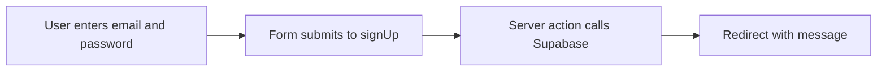

# Sign Up Page Guide

This guide explains `apps/web/app/sign-up/page.tsx` line by line.

## The Full File

```tsx
import Link from "next/link";
import Button from "@mui/material/Button";
import Container from "@mui/material/Container";
import Paper from "@mui/material/Paper";
import Stack from "@mui/material/Stack";
import TextField from "@mui/material/TextField";
import Typography from "@mui/material/Typography";
import AuthMessage from "../components/auth-message";
import PageHeader from "../components/page-header";
import { signUp } from "../auth/actions";

export default async function SignUpPage({
  searchParams
}: {
  searchParams: Promise<{ message?: string }>;
}) {
  const { message } = await searchParams;

  return (
    <Container component="main" maxWidth="sm" sx={{ py: 4 }}>
      <Paper sx={{ p: 4 }}>
        <Stack spacing={3}>
          <PageHeader heading="Sign Up" />
          <AuthMessage message={message} />
          <Stack component="form" action={signUp} spacing={2}>
            <TextField id="email" name="email" type="email" label="Email" required />
            <TextField
              id="password"
              name="password"
              type="password"
              label="Password"
              required
            />
            <Button type="submit" variant="contained">
              Create Account
            </Button>
          </Stack>
          <Typography>
            Already have an account? <Link href="/sign-in">Sign in</Link>
          </Typography>
        </Stack>
      </Paper>
    </Container>
  );
}
```

## What This File Does

This file renders the `/sign-up` page.

It shows a form that submits to the `signUp` server action.

## Line By Line

The structure is almost the same as the Sign In page, so it is a good beginner
example of reuse and consistency.

## `import { signUp } from "../auth/actions";`

This imports the server action for account creation.

## `const { message } = await searchParams;`

This reads an optional query-string message from the URL.

That lets the page show feedback after redirects.

## `<Container component="main" maxWidth="sm" sx={{ py: 4 }}>`

This creates the centered outer page wrapper.

## `<Paper sx={{ p: 4 }}>`

This creates the visual surface around the form.

## `<Stack spacing={3}>`

This creates the page’s main vertical layout.

## `<PageHeader heading="Sign Up" />`

This shows the page title.

## `<AuthMessage message={message} />`

This shows any status message from the URL.

## `<Stack component="form" action={signUp} spacing={2}>`

This renders a real HTML form using Material UI `Stack` as the wrapper.

When submitted, the form sends its data to the `signUp` server action.

## `<TextField ... />`

These render the email and password inputs.

## `<Button type="submit" variant="contained">Create Account</Button>`

This renders the submit button for account creation.

## `<Typography> ... <Link href="/sign-in">Sign in</Link> ... </Typography>`

This gives users a path to the sign-in page if they already have an account.

## Sign-Up Flow


