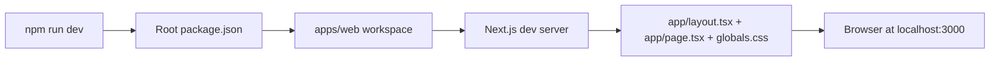
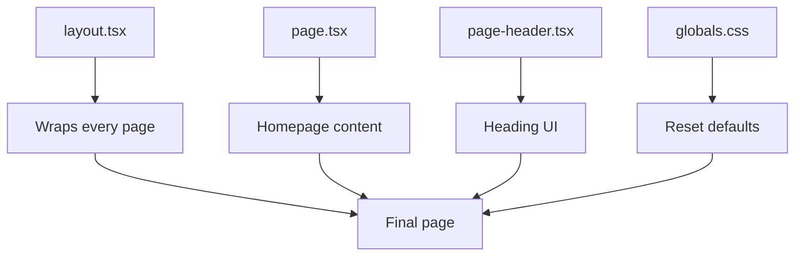

# How Rendering Works

This is a simple explanation of how the current web app becomes a webpage.



## Step 1: You Start The App

From the repository root, run:

```bash
npm run dev
```

The root `package.json` forwards that command to the `web` workspace.

## Step 2: Next.js Reads The App Files

Next.js looks inside `apps/web/app/`.

It sees:

- `layout.tsx`, which wraps the app
- `page.tsx`, which defines the homepage
- `globals.css`, which provides a small reset
- `components/page-header.tsx`, which supplies the heading UI

## Step 3: React Creates The UI

The `page.tsx` file exports a React component.

A React component is a function that returns UI written in JSX. JSX looks like
HTML, but it is actually JavaScript and TypeScript syntax for describing the
interface.

## Step 4: The Browser Displays The Result

Next.js prepares the page, and the browser shows it at
`http://localhost:3000`.

When you edit the code while the dev server is running, Next.js usually updates
the page automatically.

## In This Starter App

The flow is especially simple:

1. `layout.tsx` defines the outer document structure.
2. `page.tsx` defines the homepage content.
3. `page-header.tsx` renders the heading inside the homepage.
4. `globals.css` applies a small set of global reset defaults.

That makes this a good beginner project because there are only a few moving
parts to learn first.

## File Relationship Diagram


