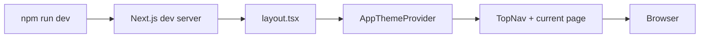
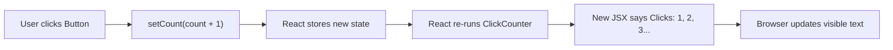
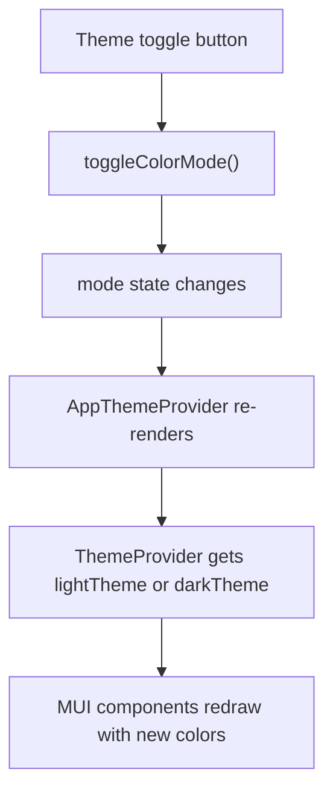
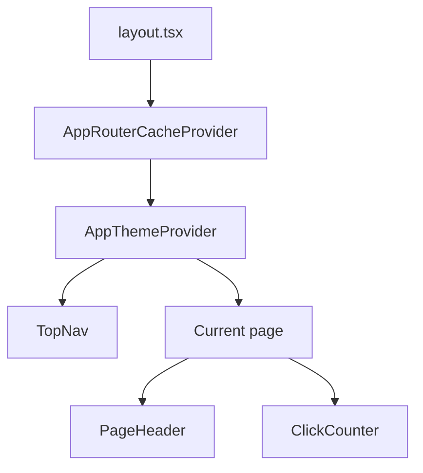

# How Rendering Works

This guide explains how the current web app becomes a webpage.

It also explains what re-rendering means when React state changes.

## Big Picture



## Step 1: You Start The App

From the repository root, run:

```bash
npm run dev
```

The root `package.json` forwards that command to the `web` workspace.

## Step 2: Next.js Reads The App Files

Next.js looks inside `apps/web/app/`.

It sees:

- `layout.tsx`, which wraps every route
- `theme-provider.tsx`, which provides the Material UI theme
- `page.tsx` and other route files, which define page content
- `components/`, which holds reusable React components
- `globals.css`, which applies a few global CSS defaults

## Step 3: React Renders Components

A React component is a function that returns JSX.

JSX is a JavaScript-friendly way to describe UI.

When React renders a component, it runs the function and reads the JSX it
returns.

In this app:

- `RootLayout` renders the outer document structure
- `AppThemeProvider` chooses the current MUI theme
- `TopNav` renders shared navigation
- the current page component renders the page-specific content

## What "Initial Render" Means

The initial render is the first time React runs a component to figure out what
should appear on screen.

For the home page, the rough flow is:

1. Next.js chooses `app/page.tsx` because the URL is `/`
2. `app/layout.tsx` wraps that page
3. `AppThemeProvider` decides whether the theme is light or dark
4. `TopNav` renders
5. the Home page renders its `Container`, `Paper`, `Stack`, `PageHeader`, and
   `ClickCounter`

## What "Re-Render" Means

A re-render happens when React runs a component again because something changed.

Common reasons:

- state changed
- props changed
- a parent component rendered again

In this app, the easiest example is `ClickCounter`.

## State Change And Re-Render

`ClickCounter` stores `count` in React state with `useState(0)`.

When the user clicks the button:

1. the button’s `onClick` handler runs
2. `setCount(count + 1)` asks React to store a new value
3. React re-runs `ClickCounter`
4. the returned JSX now contains the new number
5. React updates the browser output



## Why The Whole Page Does Not Feel Rebuilt

React may re-run a component function, but it only updates the parts of the DOM
that actually need to change.

For example, when `ClickCounter` changes:

- the navigation does not need to change
- the page heading does not need to change
- only the counter text changes

So the browser output updates efficiently.

## How The Theme Fits Into Rendering

The theme provider also participates in rendering.

When the user clicks the theme toggle in the top nav:

1. `toggleColorMode()` changes the `mode` state
2. `AppThemeProvider` re-renders
3. it chooses the other MUI theme
4. MUI components receive the new theme values
5. the app updates from light to dark, or dark to light



## File Relationship Diagram


