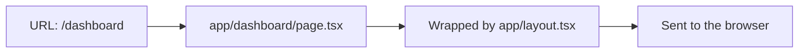

# App Router Routing Guide

This guide explains how Next.js App Router maps URLs to the directory structure
inside `apps/web/app/`.

## The Short Version

In App Router:

- folders usually represent route segments
- `page.tsx` files usually represent pages
- `route.ts` files usually represent API endpoints
- `layout.tsx` files wrap pages in the same folder and below it
- regular helper files do not create routes

That means the file and folder structure becomes the URL structure.

## Current Route Map

```mermaid
flowchart TD
    A["app/"] --> B["layout.tsx"]
    A --> C["page.tsx"]
    A --> D["about/page.tsx"]
    A --> E["contact/page.tsx"]
    A --> F["sign-up/page.tsx"]
    A --> G["sign-in/page.tsx"]
    A --> H["dashboard/page.tsx"]
    A --> I["patron/page.tsx"]
    A --> IA["patron/request/page.tsx"]
    A --> J["concierge/page.tsx"]
    A --> JA["concierge/requests/page.tsx"]
    A --> K["driver/page.tsx"]
    A --> KA["driver/opportunities/page.tsx"]
    A --> L["admin/page.tsx"]
    A --> LA["admin/users/page.tsx"]
    A --> M["api/health/route.ts"]
    A --> N["availability/actions.ts"]
    A --> O["ride-requests/actions.ts"]
    A --> P["theme-provider.tsx"]
    A --> Q["components/"]
    A --> R["auth/actions.ts"]
    B --> S["Wraps every route"]
```



The current app defines these URLs:

- `app/page.tsx` -> `/`
- `app/about/page.tsx` -> `/about`
- `app/contact/page.tsx` -> `/contact`
- `app/sign-up/page.tsx` -> `/sign-up`
- `app/sign-in/page.tsx` -> `/sign-in`
- `app/dashboard/page.tsx` -> `/dashboard`
- `app/patron/page.tsx` -> `/patron`
- `app/patron/request/page.tsx` -> `/patron/request`
- `app/concierge/page.tsx` -> `/concierge`
- `app/concierge/requests/page.tsx` -> `/concierge/requests`
- `app/driver/page.tsx` -> `/driver`
- `app/driver/opportunities/page.tsx` -> `/driver/opportunities`
- `app/admin/page.tsx` -> `/admin`
- `app/admin/users/page.tsx` -> `/admin/users`
- `app/api/health/route.ts` -> `/api/health`

## How Next.js Thinks About It



When someone visits `/dashboard`, Next.js looks for a `page.tsx` file that
matches that path.

Because the file is `app/dashboard/page.tsx`, the URL becomes `/dashboard`.

## How `layout.tsx` Fits In

`layout.tsx` does not create a URL by itself.

Instead, it wraps pages.

In this app:

- `app/layout.tsx` wraps every route in the app
- that includes `/`, `/about`, `/contact`, `/sign-up`, `/sign-in`,
  `/dashboard`, `/patron`, `/patron/request`, `/concierge`,
  `/concierge/requests`, `/driver`, `/driver/opportunities`, `/admin`, and
  `/admin/users`

## Files That Do Not Create Routes

Some files inside `app/` are important but do not map to URLs.

Examples:

- `theme-provider.tsx`: provides the MUI light/dark theme
- `availability/actions.ts`: server actions for nearby-driver lookup
- `ride-requests/actions.ts`: server actions for persisted ride requests
- `components/top-nav.tsx`: shared navigation component
- `components/dashboard-shell.tsx`: shared app-area layout for dashboard pages
- `components/click-counter.tsx`: reusable component
- `components/linear-stat-clock.tsx`: reusable homepage statistic component
- `auth/actions.ts`: server actions for sign in, sign up, and sign out
- `admin/users/actions.ts`: server actions for admin user management
- `globals.css`: global CSS file imported by the layout

These files support routing, but they are not routes themselves.

## API Routes Are Also Routes

Not every route in App Router is a page.

`route.ts` files create API endpoints.

In this app:

- `app/api/health/route.ts` creates `/api/health`

That route returns JSON instead of HTML.

## Current App Structure

```text
apps/web/app/
├── about/
│   └── page.tsx
├── admin/
│   ├── page.tsx
│   └── users/
│       ├── actions.ts
│       └── page.tsx
├── api/
│   └── health/
│       └── route.ts
├── availability/
│   └── actions.ts
├── auth/
│   └── actions.ts
├── concierge/
│   ├── page.tsx
│   └── requests/
│       └── page.tsx
├── components/
│   ├── auth-message.tsx
│   ├── click-counter.tsx
│   ├── dashboard-shell.tsx
│   ├── linear-stat-clock.tsx
│   ├── page-header.tsx
│   └── top-nav.tsx
├── contact/
│   └── page.tsx
├── dashboard/
│   └── page.tsx
├── driver/
│   ├── opportunities/
│   │   └── page.tsx
│   └── page.tsx
├── ride-requests/
│   ├── actions.ts
│   ├── request-ride-card.tsx
│   └── ride-request-list.tsx
├── globals.css
├── layout.tsx
├── page.tsx
├── patron/
│   ├── page.tsx
│   └── request/
│       └── page.tsx
├── sign-in/
│   └── page.tsx
├── sign-up/
│   └── page.tsx
└── theme-provider.tsx
```

Only folders with `page.tsx` files create routes.

The `components/` folder is just React component organization. It does not
create URLs.

The `auth/` folder also does not create a URL by itself here, because it does
not contain a `page.tsx` file. It contains server actions.

The `admin/users/actions.ts` file also does not create a URL. It supports the
`/admin/users` page, but it is not a page by itself.
