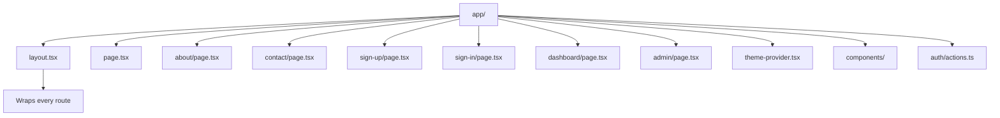
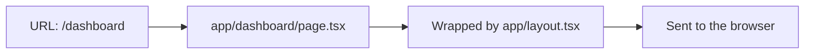

# App Router Routing Guide

This guide explains how Next.js App Router maps URLs to the directory structure
inside `apps/web/app/`.

## The Short Version

In App Router:

- folders usually represent route segments
- `page.tsx` files usually represent pages
- `layout.tsx` files wrap pages in the same folder and below it
- regular helper files do not create routes

That means the file and folder structure becomes the URL structure.

## Current Route Map



The current app defines these URLs:

- `app/page.tsx` -> `/`
- `app/about/page.tsx` -> `/about`
- `app/contact/page.tsx` -> `/contact`
- `app/sign-up/page.tsx` -> `/sign-up`
- `app/sign-in/page.tsx` -> `/sign-in`
- `app/dashboard/page.tsx` -> `/dashboard`
- `app/admin/page.tsx` -> `/admin`

## How Next.js Thinks About It



When someone visits `/dashboard`, Next.js looks for a `page.tsx` file that
matches that path.

Because the file is `app/dashboard/page.tsx`, the URL becomes `/dashboard`.

## How `layout.tsx` Fits In

`layout.tsx` does not create a URL by itself.

Instead, it wraps pages.

In this app:

- `app/layout.tsx` wraps every route in the app
- that includes `/`, `/about`, `/contact`, `/sign-up`, `/sign-in`,
  `/dashboard`, and `/admin`

## Files That Do Not Create Routes

Some files inside `app/` are important but do not map to URLs.

Examples:

- `theme-provider.tsx`: provides the MUI light/dark theme
- `components/top-nav.tsx`: shared navigation component
- `components/click-counter.tsx`: reusable component
- `auth/actions.ts`: server actions for sign in, sign up, and sign out
- `globals.css`: global CSS file imported by the layout

These files support routing, but they are not routes themselves.

## Current App Structure

```text
apps/web/app/
├── about/
│   └── page.tsx
├── admin/
│   └── page.tsx
├── auth/
│   └── actions.ts
├── components/
│   ├── auth-message.tsx
│   ├── click-counter.tsx
│   ├── page-header.tsx
│   └── top-nav.tsx
├── contact/
│   └── page.tsx
├── dashboard/
│   └── page.tsx
├── globals.css
├── layout.tsx
├── page.tsx
├── sign-in/
│   └── page.tsx
├── sign-up/
│   └── page.tsx
└── theme-provider.tsx
```

Only folders with `page.tsx` files create routes.

The `components/` folder is just React component organization. It does not
create URLs.

The `auth/` folder also does not create a URL by itself here, because it does
not contain a `page.tsx` file. It contains server actions.
