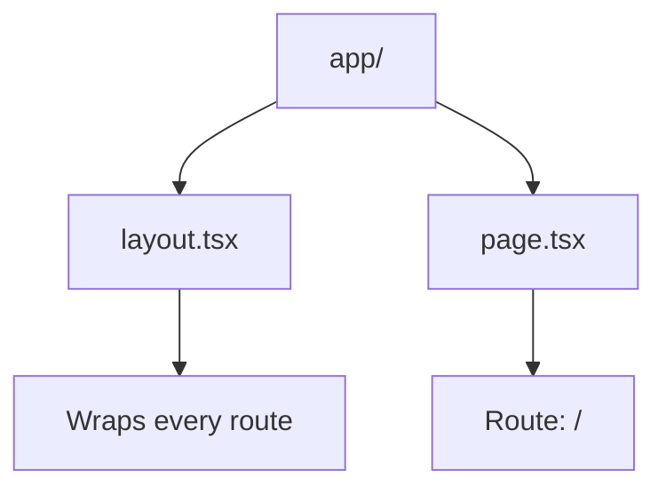
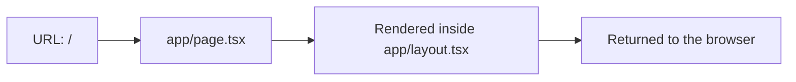
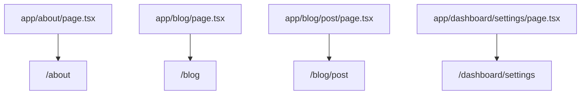

# App Router Routing Guide

This guide explains how Next.js App Router maps URLs to the directory structure
inside `apps/web/app/`.

## The Short Version

In App Router:

- folders usually represent route segments
- `page.tsx` files usually represent pages
- `layout.tsx` files wrap pages in the same folder and below it

That means the file and folder structure becomes the URL structure.

## Current Route Map

Right now the app is very small:



The current app only defines one URL:

- `app/page.tsx` -> `/`

## How Next.js Thinks About It



When someone visits `/`, Next.js looks in `app/` for a `page.tsx` file that
matches that path.

Because the homepage lives directly inside `app/`, its URL is the site root:
`/`.

## How `layout.tsx` Fits In

`layout.tsx` does not create a URL by itself.

Instead, it wraps pages.

In this app:

- `app/layout.tsx` wraps `app/page.tsx`
- so the homepage is rendered inside the root layout

## Example Directory To URL Mappings

These examples are not in the app yet, but they show the App Router pattern:



That means:

- `app/about/page.tsx` would become `/about`
- `app/blog/page.tsx` would become `/blog`
- `app/blog/post/page.tsx` would become `/blog/post`
- `app/dashboard/settings/page.tsx` would become `/dashboard/settings`

## A Useful Mental Model

You can think of App Router like this:

1. Start in `app/`
2. Walk through folders one segment at a time
3. When you hit `page.tsx`, that file becomes the page for that URL
4. Any `layout.tsx` files on the way wrap the result

## Current App Structure

Here is the actual route-related structure in this repository today:

```text
apps/web/app/
├── components/
│   └── page-header.tsx
├── globals.css
├── layout.tsx
└── page.tsx
```

Only `layout.tsx` and `page.tsx` participate in routing right now.

The `components/` folder is just regular React component organization. It does
not create URLs.

`globals.css` also does not create URLs. It is imported by the layout so its
styles apply across the app.
