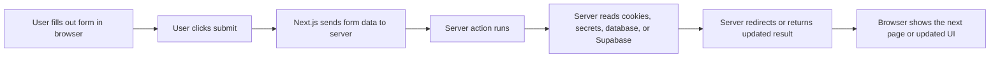

# Server Actions Guide

This guide explains what server actions are in Next.js and how they connect the
browser to server-side code.

It is written for beginners.

## The Short Version

A server action is a function that runs on the server, but can be triggered by
something in the user interface, such as a form submission or a button click.

That means:

- the user interacts in the browser
- Next.js sends the action request to the server
- the server action runs there
- the server can read secrets, databases, cookies, and sessions safely
- the result can redirect the user or update the page

## Why Server Actions Exist

In a web app, some work belongs on the server, not in the browser.

Examples:

- signing a user in
- reading or writing secure cookies
- calling a database with secret credentials
- promoting a user to admin
- turning `driver` mode on for yourself
- deleting a user account

If that code ran in the browser, secrets could be exposed.

Server actions give Next.js a built-in way to keep that work on the server
while still letting the UI trigger it.

## What Makes A Function A Server Action

In Next.js, a file or function can be marked with:

```ts
"use server";
```

That tells Next.js:

- this code belongs on the server
- do not ship it to the browser as normal client-side code

In this project, a simple example is:

- `apps/web/app/auth/actions.ts`

That file contains `signUp`, `signIn`, and `signOut`.

## How A Form Talks To A Server Action

A very common pattern looks like this:

```tsx
<form action={signIn}>
  <input name="email" />
  <input name="password" type="password" />
  <button type="submit">Sign In</button>
</form>
```

The important part is:

```tsx
action={signIn}
```

That means when the form is submitted:

1. the browser collects the form fields
2. Next.js sends that data to the server
3. the `signIn` server action runs on the server
4. the action can read the data as `FormData`
5. the action can redirect or update state afterward

## Browser And Server Responsibilities

It helps to separate the responsibilities.

### In the browser

- the user types into fields
- the user clicks buttons
- the form gets submitted
- the page displays the result

### On the server

- the action function runs
- secure helpers can be used
- cookies and sessions can be changed
- database or admin API calls can happen
- redirects can be returned

## Visual Flow



## Why This Feels Different From A Traditional API Route

Before server actions, a common pattern was:

1. create an API route
2. send a `fetch()` request to that route
3. parse JSON
4. handle the response manually

Server actions remove some of that ceremony.

Instead of:

- building a separate API endpoint
- manually calling `fetch()`

you can often connect the UI directly to the server function.

That is why this feels simpler for forms.

## The Example In This Repo

The auth flow here is a good beginner example.

### Browser page

- `apps/web/app/sign-in/page.tsx`

This page renders a form and connects it to:

- `signIn`

### Server action file

- `apps/web/app/auth/actions.ts`

That file:

- reads `FormData`
- creates a server-side Supabase client
- calls Supabase Auth
- redirects the user afterward

## What `FormData` Is

When a form submits, the action usually receives a `FormData` object.

That object lets the server action read fields by name:

```ts
const email = formData.get("email");
const password = formData.get("password");
```

That is how the server action receives values from the page.

## Why This Is Safe For Secrets

A server action runs on the server, so it can safely use:

- server-side environment variables
- secure cookies
- secret database credentials
- Supabase admin helpers
- persisted ride-request actions such as create, claim, cancel, and complete
- guardrails such as preventing duplicate active ride requests

That is why the admin-user-management actions belong on the server.

For example, promoting or deleting users should never be done directly from the
browser with a secret key.

The same is now true for role-sensitive MVP actions such as:

- turning `patron`, `concierge`, or `driver` mode on or off
- creating a patron or concierge ride request
- claiming or completing a request as a driver

## Server Action Example Types In This Repo

This app already uses server actions for a few different jobs:

- auth actions in `apps/web/app/auth/actions.ts`
- admin user-management actions in `apps/web/app/admin/users/actions.ts`
- dashboard self-role actions in `apps/web/app/dashboard/actions.ts`
- rider and driver workflow actions in `apps/web/app/ride-requests/actions.ts`
- nearby-driver lookup actions in `apps/web/app/availability/actions.ts`

That means the same idea is used for:

- normal signed-in user flows
- protected role-based flows
- protected admin-only flows

## How Redirects Fit In

A server action can call:

```ts
redirect("/dashboard");
```

That tells Next.js to send the user somewhere else after the action completes.

In this project:

- successful sign-in redirects to `/dashboard`
- sign-out redirects to `/sign-in`
- self-role changes redirect back to `/dashboard` with a confirmation message
- admin actions redirect back to `/admin/users` with a message

## Beginner Mental Model

If you want the simplest mental model, think of server actions like this:

- the page is the form the user touches
- the server action is the secure worker behind the wall
- the form hands the worker the submitted data
- the worker does the sensitive work safely
- the worker tells the app what should happen next

## Where To Read Next

- [Auth Actions Guide](./supabase/auth-actions.md): the concrete auth example in
  this repo
- [Supabase Server Client Guide](./supabase/server-client.md): how the server
  gets a Supabase client
- [Admin Access Guide](./supabase/admin-access.md): how admin-only server logic
  is protected
- [Dashboard Page Guide](./pages/dashboard-page.md): how users can now manage
  their own non-admin modes
