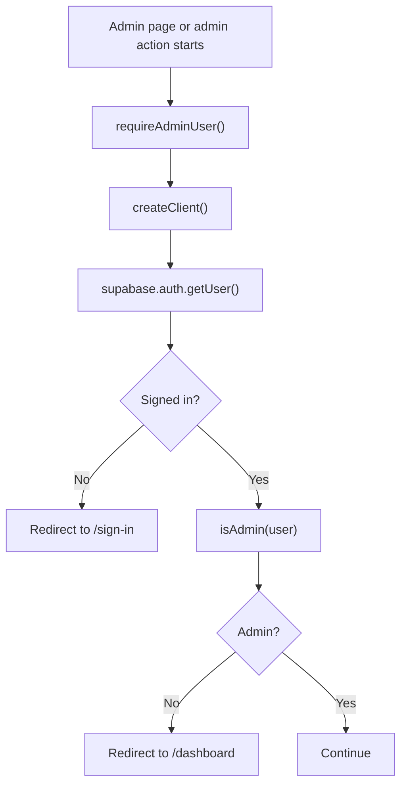

# Admin Access Guide

This guide explains `apps/web/lib/admin-access.ts`.

## What This File Does

This file holds shared helper code for admin-only access.

It answers two important questions:

- does this user count as an admin?
- should this request be allowed to continue into an admin page?

## Why This Helper Matters

Multiple admin pages need the same protection rules.

Without this file, each admin page would have to repeat:

- create a server-side Supabase client
- read the current user
- check whether the user has the admin role
- redirect away if access is not allowed

By putting that logic in one helper file, the admin pages stay smaller and more
consistent.

## Main Functions

## `isAdmin(user)`

This function checks the user’s `app_metadata`.

It returns `true` when either of these is true:

- `role === "admin"`
- `roles` is an array that contains `"admin"`

That means the app supports both:

- a single-role shape
- a multi-role shape

## `requireAdminUser()`

This function protects admin-only pages.

It:

1. creates a server-side Supabase client
2. asks Supabase for the current user
3. redirects to `/sign-in` if there is no user
4. redirects to `/dashboard` if the user is not an admin
5. returns the user if access is valid

## Why This Belongs On The Server

Admin checks are security-sensitive.

They should happen on the server so the app can trust the result before
rendering admin pages or running admin actions.

## Protection Flow

