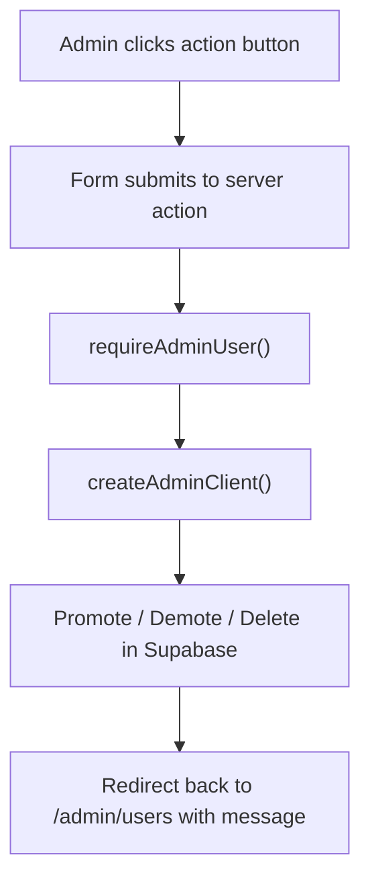

# Admin User Actions Guide

This guide explains `apps/web/app/admin/users/actions.ts`.

## What This File Does

This file contains server actions for the admin users page.

It handles:

- promoting a user to admin
- demoting an admin
- deleting a user account

## Why These Are Server Actions

These actions use the Supabase Admin API.

That API needs a secret key, so this work must stay on the server.

## Functions In This File

## `promoteUserToAdmin(formData)`

This action:

1. confirms the current request belongs to an admin
2. reads the target `userId`
3. loads that user from Supabase
4. adds `"admin"` to the user’s roles
5. redirects back to `/admin/users` with a message

## `demoteUserFromAdmin(formData)`

This action:

1. confirms the request belongs to an admin
2. blocks self-demotion
3. removes `"admin"` from the target user’s roles
4. redirects back with a message

## `deleteUserAccount(formData)`

This action:

1. confirms the request belongs to an admin
2. blocks self-deletion
3. deletes the target user from Supabase
4. redirects back with a message

## Action Flow Diagram

