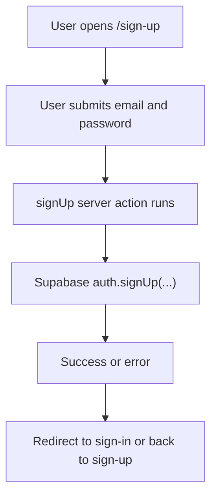
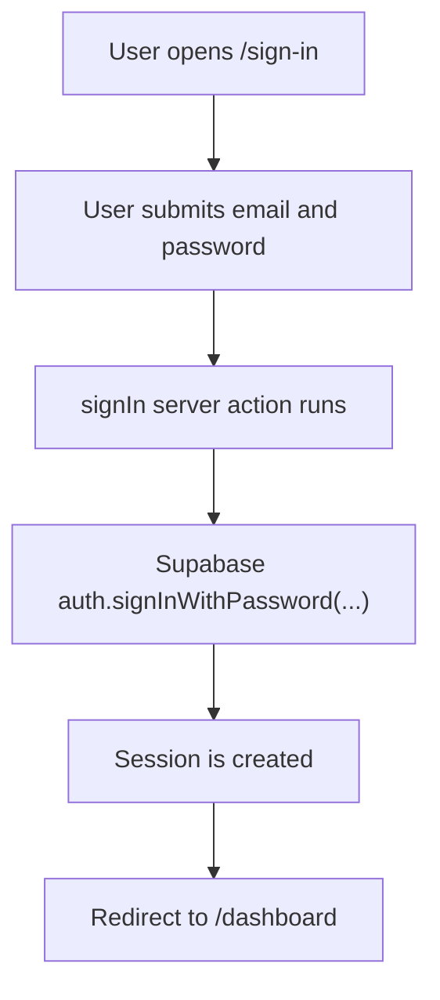
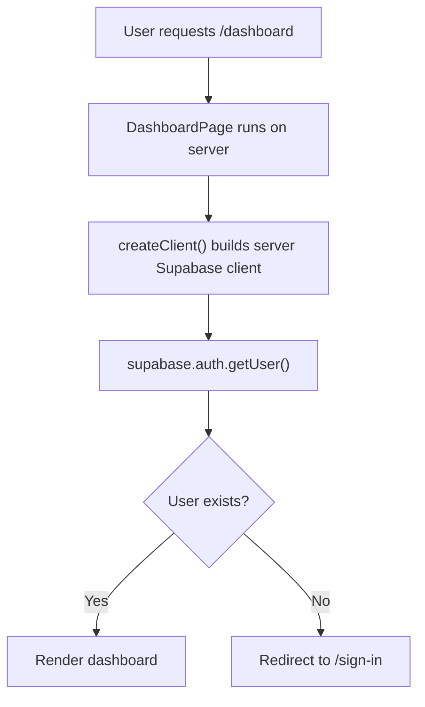
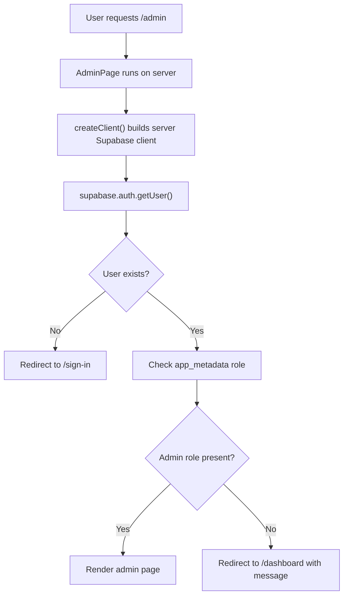
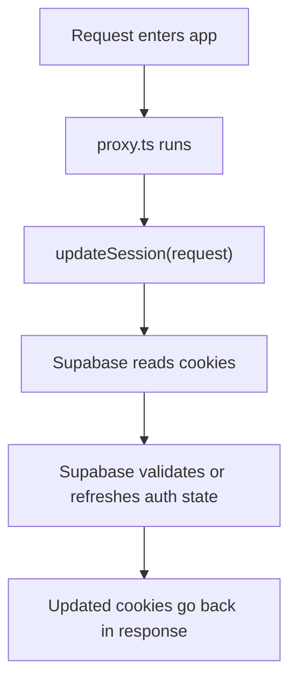

# Auth Flow Guide

This guide explains how the auth pieces work together from a beginner point of
view.

## The Main Idea

The auth flow in this project works like this:

1. the user fills out a form
2. the form calls a server action
3. the server action talks to Supabase Auth
4. Supabase creates or reads a session
5. cookies carry that session through future requests
6. protected pages check whether a user exists
7. admin-only pages also check whether the user has the `admin` role

## Sign-Up Flow

## Sign-In Flow

## Dashboard Protection Flow

## Admin Protection Flow

## Session Refresh Flow

## Which File Does What

- `sign-up/page.tsx`: shows the sign-up form
- `sign-in/page.tsx`: shows the sign-in form
- `dashboard/page.tsx`: protects and renders the dashboard
- `admin/page.tsx`: protects and renders the admin-only page
- `auth/actions.ts`: talks to Supabase for sign up, sign in, sign out
- `lib/supabase/server.ts`: creates a server-side Supabase client
- `lib/supabase/proxy.ts`: helps keep session cookies fresh
- `proxy.ts`: connects the request pipeline to the proxy helper

## Beginner Mental Model

You can think of the auth flow in two halves:

### Half 1: Asking Supabase to do auth work

That happens in the server actions:

- sign up
- sign in
- sign out

### Half 2: Checking whether a user is already signed in

That happens on protected server-rendered pages like the dashboard and admin
page.

These pages do not trust the browser alone. They ask Supabase on the server for
the current user, and the admin page also checks the user's role metadata.
