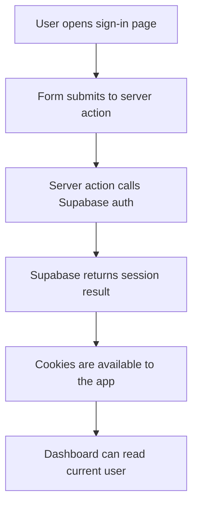

# Supabase Overview

This project uses Supabase for authentication.

Right now, the most important parts are:

- environment variables for connecting to your Supabase project
- a browser client for code that runs in the browser
- a server client for code that runs on the server
- a proxy that helps keep auth cookies fresh
- server actions for sign up, sign in, and sign out
- a protected dashboard page that checks for a signed-in user

## The Big Picture

## Files Involved

- `apps/web/.env.example`
- `apps/web/lib/supabase/env.ts`
- `apps/web/lib/supabase/client.ts`
- `apps/web/lib/supabase/server.ts`
- `apps/web/lib/supabase/proxy.ts`
- `apps/web/proxy.ts`
- `apps/web/app/auth/actions.ts`
- `apps/web/app/sign-up/page.tsx`
- `apps/web/app/sign-in/page.tsx`
- `apps/web/app/dashboard/page.tsx`

## Why There Are Different Clients

The browser and the server do not work the same way.

Because of that, this project uses:

- a browser Supabase client for browser-side code
- a server Supabase client for server-side code

This separation helps Next.js and Supabase handle cookies and sessions
correctly.
