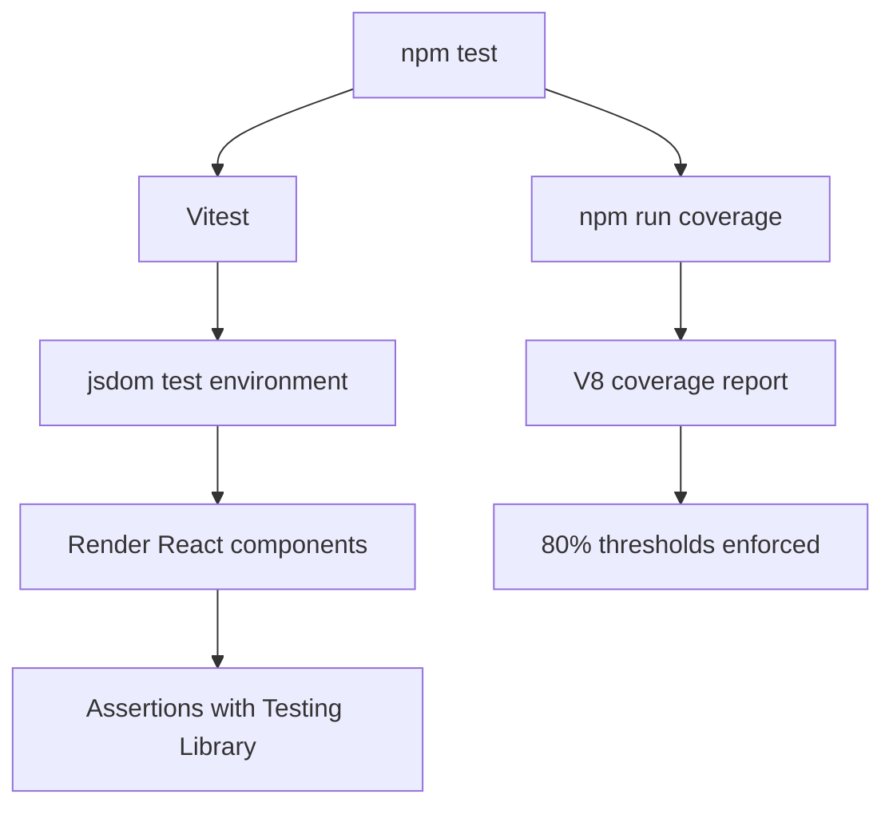

# Testing Guide

This guide explains how testing works in `apps/web`.

## What The App Uses

The web app uses:

- `Vitest` as the test runner
- `Testing Library` for rendering React components in tests
- `jsdom` as the browser-like environment for component tests
- `V8` coverage through `@vitest/coverage-v8`

## Why Vitest Fits Here

Vitest is a fast test runner that works well with React and Vite-style
tooling.

Even though this app uses Next.js, Vitest is a good fit for unit and component
tests.

## Main Commands

From the repository root:

- `npm test`
- `npm run coverage`

From the `web` workspace:

- `npm run test --workspace web`
- `npm run test:watch --workspace web`
- `npm run coverage --workspace web`

## What These Commands Do

`npm test` runs the current test suite once.

`npm run test:watch --workspace web` starts Vitest in watch mode for local
development.

`npm run coverage` runs the tests and produces coverage output.

## Coverage Rules

The project now enforces minimum coverage thresholds in
`apps/web/vitest.config.ts`.

Each category must stay at or above `80%`:

- statements
- branches
- functions
- lines

If coverage falls below those numbers, the coverage command fails.

## Where Coverage Reports Go

Coverage reports are written to:

- `apps/web/coverage/`

Vitest is configured to generate:

- text output in the terminal
- an HTML report
- a JSON summary

## What Is Being Tested Right Now

The current tests focus on reusable components in `app/components/`.

Examples include:

- `page-header`
- `auth-message`
- `click-counter`
- `death-clock`
- `linear-stat-clock`
- `top-nav`
- `dashboard-shell`

This gives the project a strong starting point for UI-level unit tests.

## Testing Diagram

