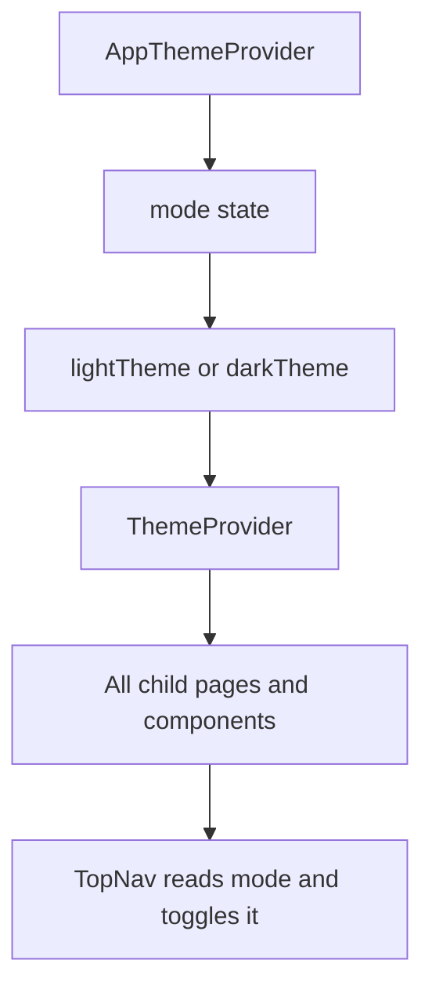

# Theme Provider Guide

This guide explains `apps/web/app/theme-provider.tsx` line by line.

## The Full File

```tsx
"use client";

import {
  createContext,
  useContext,
  useState,
  type ReactNode
} from "react";
import {
  CssBaseline,
  ThemeProvider,
  createTheme,
  type PaletteMode
} from "@mui/material";

const lightTheme = createTheme({
  palette: {
    mode: "light",
    primary: {
      main: "#0f766e"
    },
    secondary: {
      main: "#b45309"
    }
  },
  components: {
    MuiButton: {
      styleOverrides: {
        root: {
          textTransform: "none"
        }
      }
    }
  }
});

const darkTheme = createTheme({
  palette: {
    mode: "dark",
    primary: {
      main: "#5eead4"
    },
    secondary: {
      main: "#fbbf24"
    }
  },
  components: {
    MuiButton: {
      styleOverrides: {
        root: {
          textTransform: "none"
        }
      }
    }
  }
});

type ColorModeContextValue = {
  mode: PaletteMode;
  toggleColorMode: () => void;
};

const ColorModeContext = createContext<ColorModeContextValue | undefined>(
  undefined
);

export function useColorMode() {
  const context = useContext(ColorModeContext);

  if (!context) {
    throw new Error("useColorMode must be used within AppThemeProvider.");
  }

  return context;
}

export default function AppThemeProvider({
  children
}: {
  children: ReactNode;
}) {
  const [mode, setMode] = useState<PaletteMode>(() => {
    if (typeof window === "undefined") {
      return "light";
    }

    const storedMode = window.localStorage.getItem("color-mode");

    if (storedMode === "light" || storedMode === "dark") {
      return storedMode;
    }

    return window.matchMedia("(prefers-color-scheme: dark)").matches
      ? "dark"
      : "light";
  });

  const toggleColorMode = () => {
    setMode((currentMode) => {
      const nextMode = currentMode === "light" ? "dark" : "light";

      window.localStorage.setItem("color-mode", nextMode);

      return nextMode;
    });
  };

  return (
    <ColorModeContext.Provider value={{ mode, toggleColorMode }}>
      <ThemeProvider theme={mode === "light" ? lightTheme : darkTheme}>
        <CssBaseline />
        {children}
      </ThemeProvider>
    </ColorModeContext.Provider>
  );
}
```

## What This File Does

This file sets up Material UI theming for the whole app.

It provides:

- a light theme
- a dark theme
- shared React state for the current mode
- a custom hook for reading and toggling the mode
- local storage persistence for the user’s choice

## Why It Matters

Without this file, the app would not have:

- a shared theme for MUI components
- a way to switch between light and dark mode
- a common place for `TopNav` to read the current mode

## Line By Line

## `"use client";`

This makes the file a client component.

That is necessary because the file uses:

- `useState`
- `useContext`
- `window.localStorage`
- `window.matchMedia`

Those are browser-side features.

## `import { createContext, useContext, useState, type ReactNode } from "react";`

These imports bring in React tools:

- `createContext`: creates shared context
- `useContext`: reads a context value
- `useState`: stores component state
- `ReactNode`: a TypeScript type for renderable child content

## `import { CssBaseline, ThemeProvider, createTheme, type PaletteMode } from "@mui/material";`

These imports bring in Material UI theme tools:

- `createTheme`: creates a theme object
- `ThemeProvider`: gives the theme to child components
- `CssBaseline`: applies MUI’s global baseline styles
- `PaletteMode`: a type representing `"light"` or `"dark"`

## `const lightTheme = createTheme({ ... })`

This creates the theme object used when the app is in light mode.

Important parts:

- `palette.mode: "light"` tells MUI this is the light theme
- `primary.main` sets the main primary color
- `secondary.main` sets the main secondary color

## `components: { MuiButton: { styleOverrides: { ... } } }`

This is a component-level theme override.

It says:

- whenever MUI renders a `Button`
- change the root button style
- set `textTransform: "none"`

That is why button labels are no longer forced to uppercase.

## `const darkTheme = createTheme({ ... })`

This creates the theme object used in dark mode.

It follows the same structure as `lightTheme`, but with different palette
values.

## `type ColorModeContextValue = { ... }`

This defines the shape of the context value.

The context will hold:

- `mode`
- `toggleColorMode`

## `const ColorModeContext = createContext<...>(undefined);`

This creates the context.

The starting value is `undefined`, which makes it easier to detect incorrect
usage later.

## `export function useColorMode() { ... }`

This is a custom hook.

Its job is to give other components an easy way to access the color mode
context.

## `const context = useContext(ColorModeContext);`

This reads the current context value.

## `if (!context) { throw new Error(...); }`

This protects the hook.

If a component tries to use `useColorMode()` outside the provider, the hook
throws a helpful error instead of failing silently.

## `export default function AppThemeProvider({ children }: { children: ReactNode; })`

This defines the provider component.

It accepts `children`, which means the rest of the app will be rendered inside
it.

## `const [mode, setMode] = useState<PaletteMode>(() => { ... })`

This creates state for the current theme mode.

The initial value is calculated by a function.

Using a function here is helpful because React only runs that initial setup when
it first creates the state.

## `if (typeof window === "undefined") { return "light"; }`

This protects the code during server rendering.

On the server, there is no `window` object, so the code falls back to `"light"`.

## `const storedMode = window.localStorage.getItem("color-mode");`

This tries to read the previously saved theme mode from local storage.

## `if (storedMode === "light" || storedMode === "dark") { return storedMode; }`

If a valid saved value exists, the app uses that value.

That way the user keeps their preference after refreshing the page.

## `return window.matchMedia("(prefers-color-scheme: dark)").matches ? "dark" : "light";`

If there is no saved value, the app checks the user’s system preference.

If the operating system prefers dark mode, the app starts in dark mode.

Otherwise it starts in light mode.

## `const toggleColorMode = () => { ... }`

This defines the function that flips the current mode.

## `setMode((currentMode) => { ... })`

This updates state based on the current value.

Using the callback form is a safe pattern because it always works with the most
recent state.

## `const nextMode = currentMode === "light" ? "dark" : "light";`

This decides which mode should come next.

## `window.localStorage.setItem("color-mode", nextMode);`

This saves the new mode so the choice survives page reloads.

## `<ColorModeContext.Provider value={{ mode, toggleColorMode }}>`

This makes `mode` and `toggleColorMode` available to all child components.

That is how `TopNav` can read and update the mode.

## `<ThemeProvider theme={mode === "light" ? lightTheme : darkTheme}>`

This gives Material UI the current theme object.

If the mode is light, it uses `lightTheme`.

If the mode is dark, it uses `darkTheme`.

## `<CssBaseline />`

This applies MUI’s baseline global styles.

It works alongside the small custom rules in `globals.css`.

## `{children}`

This renders the rest of the app inside the theme provider.

## Theme Flow Diagram


